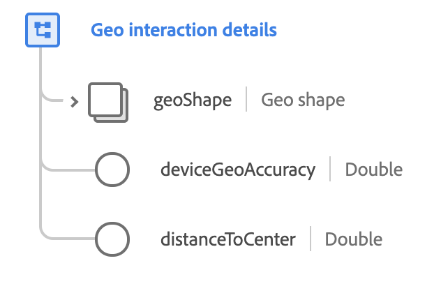

# [!UICONTROL Type de données ] détaillé de l’interaction géographique

[!UICONTROL Les ] détails de l’interaction géographique correspondent à un type de données XDM standard qui décrit l’état actuel de l’inclusion dans une zone géographiquement définie.

 

| Propriété | Type de données | Description |
| --- | --- | --- |
| `geoShape` | [[!UICONTROL Forme géographique]](./geo-shape.md) | Décrit la forme géographique de la zone avec laquelle l’interaction a lieu. Ce champ peut décrire une zone, un cercle ou un polygone. |
| `deviceGeoAccuracy` | Double | Précision du dispositif ou mécanisme de mesure géographique, mesurée en mètres. |
| `distanceToCenter` | Doublon | La distance au centre de la zone géographique dans le cas d&#39;un cercle géographique, mesurée en mètres. |

Pour plus d&#39;informations sur le type de données, consultez le référentiel XDM public :

* [Exemple renseigné](https://github.com/adobe/xdm/blob/master/components/datatypes/geo-interaction-details.example.1.json)
* [Schéma complet](https://github.com/adobe/xdm/blob/master/components/datatypes/geo-interaction-details.schema.json)
