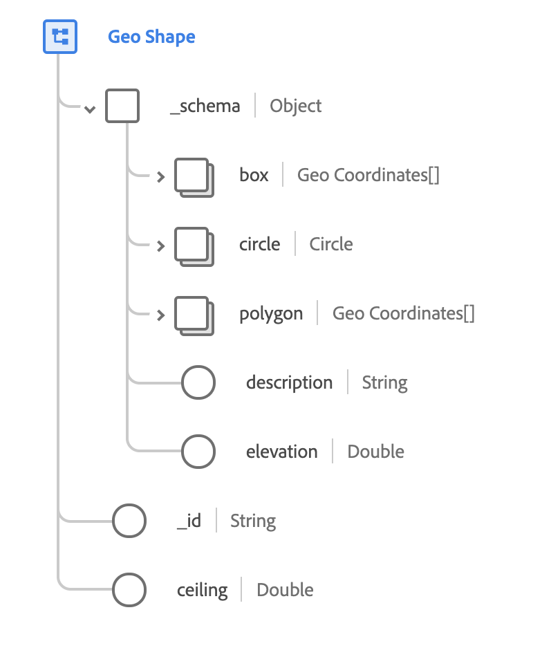

# Type de données [!UICONTROL Forme géographique]

[!UICONTROL Forme géographique] est un type de données XDM standard qui décrit la forme d’une zone géographique. Ce type de données est basé sur la spécification publique documentée sur [schema.org](https://schema.org/GeoShape).

{width=500}

| Propriété | Type de données | Description |
| --- | --- | --- |
| `_schema.box` | Tableau de [[!UICONTROL coordonnées géographiques]](./geo-coordinates.md) | Décrit une zone géographique délimitée par un rectangle formé par deux coordonnées. La première coordonnée est le coin inférieur du rectangle, et la seconde coordonnée est le coin supérieur. |
| `_schema.circle` | Tableau de [[!UICONTROL coordonnées géographiques]](./geo-coordinates.md) | Décrit une zone circulaire ayant un rayon donné, centrée sur une coordonnée géographique. |
| `_schema.polygon` | [[!UICONTROL Cercle géographique]](./geo-circle.md) | Une série d’au moins quatre coordonnées dont la première et la dernière coordonnées sont identiques. |
| `_schema.description` | Chaîne | Description de ce qui est défini par la forme. |
| `_schema.elevation` | Double | Élévation spécifique ou minimale de la forme. Cette valeur est conforme à la référence [WGS84](https://gisgeography.com/wgs84-world-geodetic-system/) et elle est mesurée en mètres. Combinée avec `ceiling`, vous pouvez utiliser cette propriété pour exprimer un cadre de sélection tridimensionnel pour un emplacement. |
| `_id` | Chaîne | Identifiant unique généré par le système pour la forme. |
| `ceiling` | Double | Élévation maximale de la forme. Cette propriété n’est valide que lorsqu’elle est utilisée en combinaison avec `elevation`. La valeur est conforme au système [WGS84](https://gisgeography.com/wgs84-world-geodetic-system/) et est mesurée en mètres. Combinée avec `elevation`, vous pouvez utiliser cette propriété pour exprimer un cadre de sélection tridimensionnel pour un emplacement. |
