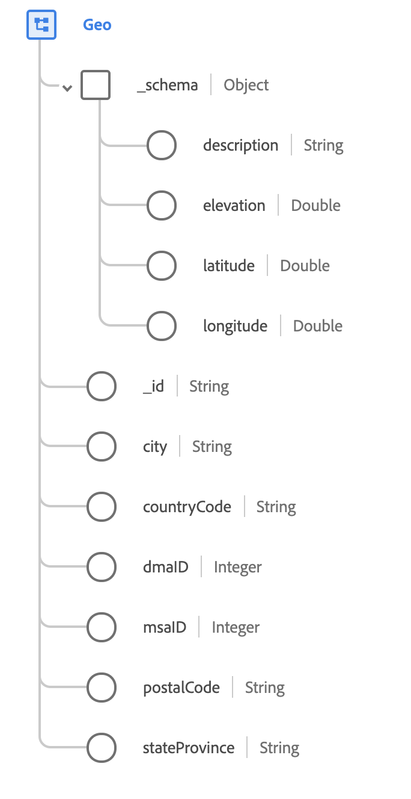

# Type de données [!UICONTROL Geo]

[!UICONTROL Géo] est un type de données XDM standard qui décrit la zone géographique dans laquelle un événement a été observé.

{width=400}

| Propriété | Type de données | Description |
| --- | --- | --- |
| `_schema` | [[!UICONTROL Coordonnées géographiques]](./geo-coordinates.md) | Décrit les coordonnées géographiques d’un emplacement. |
| `_id` | Chaîne | Identifiant unique généré par le système pour les coordonnées. |
| `city` | Chaîne | Nom de la ville. |
| `countryCode` | Chaîne | Code <a href="https://datahub.io/core/country-list">ISO 3166-1 alpha-2</a> à deux caractères pour le pays. |
| `dmaID` | Entier | Zone de marché désignée par Nielsen Media Research. |
| `msaID` | Entier | Région métropolitaine des États-Unis dans laquelle l’observation a été effectuée. |
| `postalCode` | Chaîne | Code postal de l’emplacement. Les codes postaux ne sont pas disponibles pour tous les pays. Dans certains pays, ce champ ne contiendra qu’une partie du code postal. |
| `stateProvince` | Chaîne | Partie de l’état ou de la province de l’observation. Le format suit la norme [ISO 3166-2 (pays et subdivisions)](https://www.unece.org/cefact/locode/subdivisions.html). |

{style="table-layout:auto"}

Pour plus d’informations sur ce type de données, reportez-vous au référentiel XDM public :

* [Exemple renseigné](https://github.com/adobe/xdm/blob/master/components/datatypes/demographic/geo.example.1.json)
* [Schéma complet](https://github.com/adobe/xdm/blob/master/components/datatypes/demographic/geo.schema.json)
