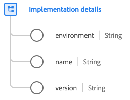

# [!UICONTROL Détails d’implémentation] type de données

[!UICONTROL &#x200B; Détails d’implémentation &#x200B;] est un type de données standard du modèle de données d’expérience (XDM) qui décrit une implémentation technologique, telle qu’une API ou un SDK.

| Propriété | Type de données | Description |
| --- | --- | --- |
| `environment` | Chaîne | Environnement de la mise en œuvre. |
| `name` | Chaîne | Identifiant du SDK ou du point d’entrée. Tous les SDK ou points d’entrée sont identifiés via un URI, y compris les extensions. |
| `version` | Chaîne | Version de l’API ou du SDK. |

{style="table-layout:auto"}

Pour plus d’informations sur ce type de données, reportez-vous au référentiel XDM public :

* [Exemple renseigné](https://github.com/adobe/xdm/blob/master/components/datatypes/industry-verticals/implementationdetails.example.1.json)
* [Schéma complet](https://github.com/adobe/xdm/blob/master/components/datatypes/industry-verticals/implementationdetails.schema.json)
