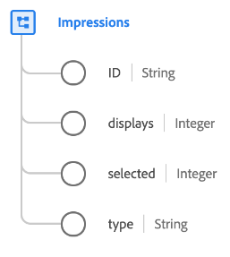

# Type de données [!UICONTROL Impressions]

[!UICONTROL Impressions] est un type de données XDM standard qui décrit une impression marketing, qui est une mesure utilisée pour quantifier le nombre de vues ou d’engagements numériques pour un élément de contenu tel qu’une publicité, une publication numérique ou une page web.

| Propriété | Type de données | Description |
| --- | --- | --- |
| `ID` | Chaîne | ID unique de l’impression. |
| `displays` | Entier | Nombre de fois où l’élément d’impression a été affiché pour un client. |
| `selected` | Entier | Nombre de fois où l’élément d’impression a été sélectionné. |
| `type` | Chaîne | Type d’impression. |

{style="table-layout:auto"}

Pour plus d’informations sur le groupe de champs , consultez le référentiel XDM public :

* [Exemple renseigné](https://github.com/adobe/xdm/blob/master/components/datatypes/industry-verticals/impressions.example.1.json)
* [Schéma complet](https://github.com/adobe/xdm/blob/master/components/datatypes/industry-verticals/impressions.schema.json)
