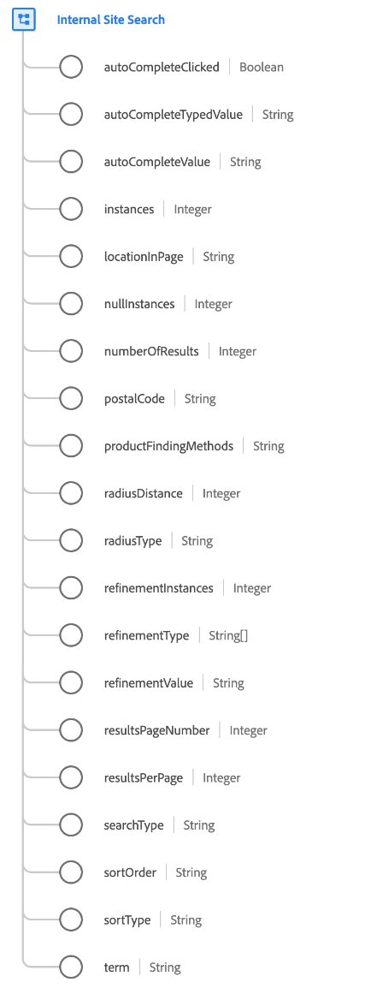

# [!UICONTROL recherche interne au site] type de données

[!UICONTROL Recherche interne au site] est un type de données XDM standard qui décrit une recherche interne au site, y compris tous les détails et comportements de recherche associés.

| Propriété | Type de données | Description |
| --- | --- | --- |
| `autoCompleteClicked` | [!UICONTROL booléen] | Indique si un visiteur a utilisé une valeur de recherche suggérée ou saisie automatiquement pour exécuter la recherche. |
| `autoCompleteTypedValue` | [!UICONTROL Chaîne] | Pour les scénarios de saisie semi-automatique, les utilisateurs abandonnent parfois leur recherche et sélectionnent un terme spécifique dans la liste déroulante. Cette valeur effectue le suivi de ce que l’utilisateur a commencé à saisir afin de générer l’ensemble spécifique de termes de recherche suggérés. |
| `autoCompleteValue` | [!UICONTROL Chaîne] | Pour les scénarios de saisie semi-automatique, les utilisateurs abandonnent parfois leur recherche et sélectionnent un terme spécifique dans le menu déroulant. Cette valeur est utilisée pour effectuer le suivi des termes spécifiques sélectionnés. |
| `instances` | [!UICONTROL Entier] | Nombre de fois où la recherche interne au site a été effectuée. |
| `locationInPage` | [!UICONTROL Chaîne] | Lorsqu’il existe plusieurs zones de recherche sur la page, cette valeur doit être utilisée pour identifier l’emplacement spécifique utilisé pour la recherche. |
| `nullInstances` | [!UICONTROL Entier] | Nombre de fois où la recherche interne sur site n’a donné aucun résultat. |
| `numberOfResults` | [!UICONTROL Entier] | Nombre total de résultats de recherche renvoyés. |
| `postalCode` | [!UICONTROL Chaîne] | Code postal de la recherche, le cas échéant. |
| `productFindingMethods` | [!UICONTROL Chaîne] | Valeur du terme de recherche interne sur site avec liaison de marchandisage. Cette valeur indique le terme qui a été recherché juste avant d’afficher un produit. |
| `radiusDistance` | [!UICONTROL Entier] | Combiné avec `radiusType`, indique la distance sélectionnée du rayon de recherche. |
| `radiusType` | [!UICONTROL Entier] | Type de distance sélectionné de `radiusDistance`, miles ou kilomètres. |
| `refinementInstances` | [!UICONTROL Entier] | Nombre de fois où la recherche interne sur site a été affinée. |
| `refinementType` | Tableau de chaînes | Répertorie les types d’affinement appliqués aux résultats de la recherche. Par exemple, le service, la marque, le prix, en magasin, la note attribuée, la couleur, le matériel, etc. |
| `refinementValue` | [!UICONTROL Chaîne] | Valeur sur laquelle la recherche a été affinée. |
| `resultsPageNumber` | [!UICONTROL Entier] | Pour les résultats de recherche paginés, cette valeur effectue le suivi de la page de résultats consultée par le visiteur. |
| `resultsPerPage` | [!UICONTROL Entier] | Pour les résultats de recherche paginés, cette valeur effectue le suivi du nombre de résultats de recherche affichés par page. |
| `searchType` | [!UICONTROL Chaîne] | Capture la méthode de recherche en cours d’exécution, le cas échéant. Par exemple, une recherche avec saisie semi-automatique, une recherche avec saisie directe ou tout autre type de fonctionnalité de recherche personnalisée sur un site. |
| `sortOrder` | [!UICONTROL Chaîne] | Combiné à `sortType`, indique l’ordre de tri des résultats de recherche, croissant ou décroissant. |
| `term` | [!UICONTROL Chaîne] | Terme de recherche interne sur le site saisi par le visiteur. |

{style="table-layout:auto"}

Pour plus d’informations sur ce type de données, reportez-vous au [référentiel XDM public](https://github.com/adobe/xdm/blob/master/docs/reference/datatypes/internal-site-search.schema.json).
