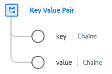

# Type de données [!UICONTROL Key Value Pair]

[!UICONTROL Key Value Pair] est un type de données standard du modèle de données d’expérience (XDM) qui capture les détails d’une paire clé-valeur générique. Ce type de données est utilisé dans le groupe de champs [&#128279;](../field-groups/event/analytics-full-extension.md) pour décrire les éléments de tableau d’une variable de liste.[!UICONTROL Adobe Analytics ExperienceEvent Full Extension]

| Propriété | Type de données | Description |
| --- | --- | --- |
| `key` | Chaîne | Clé (nom) d’une variable ou valeur générique. |
| `value` | Chaîne | Valeur de la variable. |

{style="table-layout:auto"}

Pour obtenir plus d’informations sur ce type de données, reportez-vous au [référentiel XDM public](https://github.com/adobe/xdm/blob/master/extensions/adobe/experience/analytics/keyvalue.schema.json).
