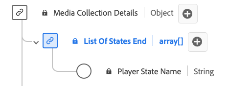

# Type de données [!UICONTROL List of States End]

Le type de données de collecte de fin de liste d’états est un type de données de modèle de données d’expérience (XDM) conçu pour représenter les informations relatives à l’état de fin de divers attributs du lecteur. Elle inclut les propriétés [!UICONTROL Player State Name] qui indiquent l’état spécifique de l’attribut (par exemple, « fullscreen », « mute », « closedCaptioning »). Ce type de données est utilisé pour capturer et décrire les conditions initiales de différents états du lecteur.

| Nom d’affichage | Propriété | Type de données | Obligatoire | Description |
|--------------------------------|--------------|-----------|-----------|-------------------------------------------------|
| [!UICONTROL Player State Name] | `name` | chaîne | Non | Nom de l’état du lecteur. Énumérées : « fullscreen », « mute », « closeCaptioning », « pictureInPicture », « inFocus » avec leurs significations respectives. |

{style="table-layout:auto"}
