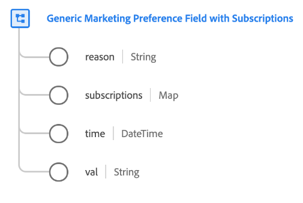

# [!UICONTROL Champ générique de préférences marketing avec type de données Abonnements]

Le [!UICONTROL champ générique de préférences marketing avec abonnements] est un type de données XDM standard qui décrit la sélection d’une préférence marketing spécifique par un client ou une cliente.

>[!NOTE]
>
>Ce type de données est destiné à être utilisé pour personnaliser la structure des schémas de consentement de votre organisation à l’aide du groupe de champs [[!UICONTROL Consentements et préférences] comme ligne de base](../field-groups/profile/consents.md).
>
>Si vous n’avez pas besoin de mappage de `subscriptions` pour un champ de préférence marketing spécifique, vous pouvez utiliser le [type de données de champ marketing de base](./marketing-field.md) à la place.



| Propriété | Type de données | Description |
| --- | --- | --- |
| `reason` | Chaîne | Lorsqu’un client se désinscrit d’un cas d’utilisation marketing, ce champ de chaîne représente la raison pour laquelle le client s’est désinscrit. |
| `subscriptions` | Carte | Carte des préférences marketing des clients pour des abonnements spécifiques. Pour plus d’informations, consultez la section sur les [abonnements](#subscriptions). |
| `time` | DateTime | Horodatage [ISO 8601](https://datatracker.ietf.org/doc/html/rfc3339#section-5.6) (`yyyy-MM-dd'T'HH:mm:ssXXX`) du moment où la préférence marketing a changé, le cas échéant. |
| `val` | Chaîne | Choix de préférence fourni par le client pour ce cas d’utilisation marketing. Voir la [section suivante](#val) pour connaître les valeurs et définitions acceptées. |

{style="table-layout:auto"}

## `val` {#val}

Le tableau suivant décrit les valeurs acceptées pour `val` :

| Valeur | Titre | Description |
| --- | --- | --- |
| `y` | Oui (opt-in) | Le client a choisi la préférence. En d&#39;autres termes, ils **consentent** à l&#39;utilisation de leurs données comme indiqué par la préférence en question. |
| `n` | Non (opt-out) | Le client s’est désabonné de la préférence. En d&#39;autres termes, ils **ne consentent pas** à l&#39;utilisation de leurs données comme indiqué par la préférence en question. |
| `p` | En attente de vérification | Le système n&#39;a pas encore reçu de valeur de préférence finale. Elle est le plus souvent utilisée dans le cadre d’un consentement qui nécessite une vérification en deux étapes. Par exemple, si un client ou une cliente accepte de recevoir des e-mails, ce consentement est défini sur `p` jusqu’à ce qu’il ou elle sélectionne un lien dans un e-mail pour vérifier qu’il ou elle a fourni la bonne adresse e-mail. À ce stade, le consentement est mis à jour sur `y`. <br><br>Si cette préférence n’utilise pas de processus de vérification à deux ensembles, le choix `p` peut plutôt être utilisé pour indiquer que le client ou la cliente n’a pas encore répondu à l’invite de consentement. Par exemple, vous pouvez définir automatiquement la valeur sur `p` sur la première page d’un site web, avant que le client n’ait répondu à l’invite de consentement. Dans les juridictions qui n’exigent pas de consentement explicite, vous pouvez également l’utiliser pour indiquer que le client ne s’est pas explicitement opposé (en d’autres termes, le consentement est présumé). |
| `u` | Inconnu | Les informations sur les préférences du client sont inconnues. |
| `dy` | Valeur par défaut de Oui (opt-in) | Le client n&#39;a pas fourni lui-même de valeur de consentement et est traité par défaut comme un accord préalable (« Oui »). En d’autres termes, le consentement est présumé jusqu’à ce que le client indique le contraire.<br><br>Notez que si des lois ou des modifications apportées à la politique de confidentialité de votre entreprise entraînent des modifications des valeurs par défaut de certains utilisateurs ou de tous les utilisateurs, vous devez mettre à jour manuellement tous les profils contenant des valeurs par défaut. |
| `dn` | Valeur par défaut de Non (opt-out) | Le client n&#39;a pas fourni lui-même de valeur de consentement et est traité par défaut comme un désabonnement (« Non »). En d’autres termes, le client est présumé avoir refusé son consentement jusqu’à ce qu’il indique le contraire.<br><br>Notez que si des lois ou des modifications apportées à la politique de confidentialité de votre entreprise entraînent des modifications des valeurs par défaut de certains utilisateurs ou de tous les utilisateurs, vous devez mettre à jour manuellement tous les profils contenant des valeurs par défaut. |
| `LI` | Intérêt Légitime | L’intérêt commercial légitime de collecter et de traiter ces données à des fins spécifiques l’emporte sur le préjudice potentiel qu’elles peuvent causer à la personne concernée. |
| `CT` | Contrat | La collecte de données à des fins précises est nécessaire pour respecter les obligations contractuelles avec la personne concernée. |
| `CP` | Respect d&#39;une obligation légale | La collecte de données à des fins précises est nécessaire pour respecter les obligations légales de l&#39;entreprise. |
| `VI` | Intérêt vital de l&#39;individu | La collecte de données aux fins spécifiées est nécessaire pour protéger les intérêts vitaux de l&#39;individu. |
| `PI` | Intérêt Public | La collecte de données à des fins spécifiques est nécessaire à l&#39;exécution d&#39;une mission d&#39;intérêt public ou dans l&#39;exercice de l&#39;autorité publique. |

{style="table-layout:auto"}

## `subscriptions` {#subscriptions}

Certaines entreprises permettent aux clients de s’inscrire à différents abonnements associés à un canal marketing particulier. Par exemple, une société bancaire peut permettre aux clients de s’abonner à des alertes téléphoniques en cas de comptes à découvert ou de recevoir des appels commerciaux pour des offres de programme de fidélité.

Le fichier JSON suivant représente un exemple de champ marketing pour un canal marketing d’appel téléphonique qui contient un mappage `subscriptions`. Chaque clé de l’objet `subscriptions` représente un abonnement individuel pour le canal marketing. Chaque abonnement contient alors une valeur d’opt-in (`val`).

```json
"email-marketing-field": {
  "val": "y",
  "time": "2019-01-01T15:52:25+00:00",
  "subscriptions": {
    "loyalty-offers": {
      "val": "y",
      "type": "sales",
      "topics": ["discounts", "early-access"],
      "subscribers": {
        "jdoe@example.com": {
          "time": "2019-01-01T15:52:25+00:00",
          "source": "website"
        }
      }
    },
    "newsletters": {
      "val": "y",
      "type": "advertising",
      "topics": ["hardware"],
      "subscribers": {
        "jdoe@example.com": {
          "time": "2021-01-01T08:32:53+07:00",
          "source": "website"
        },
        "tparan@example.com": {
          "time": "2020-02-03T07:54:21+07:00",
          "source": "call center"
        }
      }
    }
  }
}
```

| Propriété | Description |
| --- | --- |
| `val` | [valeur de consentement](#val) pour l’abonnement. |
| `type` | Type d’abonnement. Il peut s’agir de n’importe quelle chaîne descriptive, à condition qu’elle comporte 15 caractères ou moins. |
| `topics` | Tableau de chaînes qui représentent les centres d’intérêt auxquels un client ou une cliente s’est abonné et qui peuvent être utilisées pour lui envoyer du contenu pertinent. |
| `subscribers` | Champ facultatif de type map qui représente un ensemble d’identifiants (tels que des adresses e-mails ou des numéros de téléphone) qui se sont abonnés à un abonnement particulier. Chaque clé de cet objet représente l’identifiant en question et contient deux sous-propriétés : <ul><li>`time` : date et heure ISO 8601 (`yyyy-MM-dd'T'HH:mm:ssXXX`) du moment où l’identité s’est abonnée, le cas échéant.</li><li>`source` : source d’où provient l’abonné. Il peut s’agir de n’importe quelle chaîne descriptive, à condition qu’elle comporte 15 caractères ou moins.</li></ul> |

{style="table-layout:auto"}

## Ressources supplémentaires

Pour plus d’informations sur ce type de données, reportez-vous au référentiel XDM public :

* [Exemple renseigné](https://github.com/adobe/xdm/blob/master/components/datatypes/consent/marketing-field-basic.example.1.json)
* [Schéma complet](https://github.com/adobe/xdm/blob/master/components/datatypes/consent/marketing-field-basic.schema.json)
