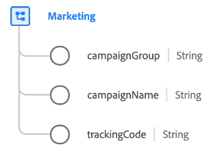

# Type de données [!UICONTROL Marketing]

[!UICONTROL Marketing] est un type de données XDM standard qui décrit les activités marketing actives avec un point de contact particulier.

| Propriété | Type de données | Description |
| --- | --- | --- |
| `campaignGroup` | Chaîne | Nom du groupe de campagnes (dans les cas où plusieurs campagnes sont regroupées comme `50%_DISCOUNT`). |
| `campaignName` | Chaîne | Nom de la campagne marketing, tel que `50%_DISCOUNT_USA` ou `50%_DISCOUNT_ASIA`. |
| `trackingCode` | Chaîne | Code de suivi qui peut être utilisé pour identifier la campagne marketing à laquelle l’événement est associé. |

{style="table-layout:auto"}

Pour plus d’informations sur le groupe de champs , consultez le référentiel XDM public :

* [Exemple renseigné](https://github.com/adobe/xdm/blob/master/components/datatypes/marketing/marketing.example.1.json)
* [Schéma complet](https://github.com/adobe/xdm/blob/master/components/datatypes/marketing/marketing.schema.json)
