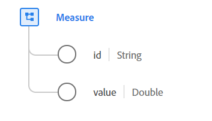

# Type de données [!UICONTROL Measure]

[!UICONTROL Measure] est un type de données standard du modèle de données d’expérience (XDM) qui contient un point de données quantifiable concret d’une mesure particulière. Une mesure est composée d’un identifiant unique et d’une valeur.

{width=500}

| Propriété | Type de données | Description |
| --- | --- | --- |
| `id` | Chaîne | Identifiant unique de cette mesure. Dans le cas de la collecte de données à l’aide de canaux de communication avec perte, tels que des applications mobiles ou des sites web avec une fonctionnalité hors ligne, pour lesquels la transmission des mesures ne peut pas être assurée, cette propriété contient un identifiant unique, généré par le client, de la mesure prise. Il est recommandé de rendre cette opération suffisamment longue pour garantir un caractère aléatoire suffisant.    Si des informations telles que la date et l’heure, l’ID d’appareil, l’adresse IP, l’adresse MAC ou d’autres valeurs d’identification d’utilisateur sont intégrées à la génération du `id`, le résultat doit être haché. Cela permet de s’assurer qu’aucune PII n’est codée dans la valeur, car l’objectif n’est pas d’identifier un utilisateur ou un appareil, mais la mesure spécifique dans le temps. |
| `value` | Double | Valeur quantifiable de cette mesure. |

{style="table-layout:auto"}

Pour plus d’informations sur ce type de données, reportez-vous au référentiel XDM public :

* [Exemple renseigné](https://github.com/adobe/xdm/blob/master/components/datatypes/data/measure.example.1.json)
* [Schéma complet](https://github.com/adobe/xdm/blob/master/components/datatypes/data/measure.schema.json)
