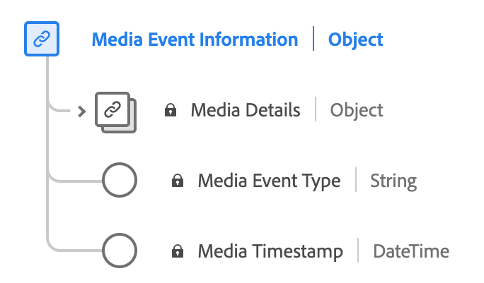

# Type de données [!UICONTROL Media Event Information]

[!UICONTROL Media Event Information] est un type de données standard du modèle de données d’expérience (XDM) qui décrit les informations détaillées sur les médias liées à l’événement d’expérience.

| Propriété | Type de données | Description |
| --- | --- | --- |
| `mediaCollection` | [!UICONTROL mediaDetails] | Informations détaillées sur le média relatives à l’événement d’expérience. Ce type de données est utilisé pour la [collecte de données multimédia](./media-collection-details.md) et la [création de rapports sur les données multimédia](./media-reporting-details.md). |
| `mediaEventTimestamp` | [!UICONTROL String] | Heure à laquelle un événement multimédia s’est produit. |
| `mediaEventType` | [!UICONTROL String] | Type d’événement multimédia. |

{style="table-layout:auto"}

Pour plus d’informations sur le groupe de champs , consultez le [référentiel XDM public](https://github.com/adobe/xdm/blob/master/components/datatypes/mediaevent.schema.json)
