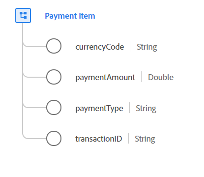

# Type de données [!UICONTROL Payment Item]

[!UICONTROL Payment Item] est un type de données XDM (modèle de données d’expérience) standard qui décrit un paiement associé à une commande qui définit le type de paiement, le montant et la devise associée.

{width=400}

| Propriété | Type de données | Description |
| --- | --- | --- |
| `currencyCode` | Chaîne | Code de devise ISO 4217 utilisé pour les totaux des commandes. Toutes les instances doivent être conformes au `^[A-Z]{3}$` d’expression régulière. Par exemple, `USD` et `EUR`. |
| `paymentAmount` | Double | Valeur du paiement. |
| `paymentType` | Chaîne | Mode de paiement pour cette commande. Les valeurs d’énumération acceptées sont les suivantes : <li> `cash` </li> <li> `credit_card` </li> <li> `debit_card` </li> <li> `gift_card` </li> <li> `check` </li> <li> `paypal` </li> <li> `wire_transfer` </li> <li> `credit_card_reference` </li> <li> `other` </li> |
| `transactionID` | Chaîne | Identifiant de transaction unique pour cet élément de paiement. |

{style="table-layout:auto"}

Pour plus d’informations sur ce type de données, reportez-vous au référentiel XDM public :

* [Exemple renseigné](https://github.com/adobe/xdm/blob/master/components/datatypes/data/paymentitem.example.1.json)
* [Schéma complet](https://github.com/adobe/xdm/blob/master/components/datatypes/data/paymentitem.schema.json)
