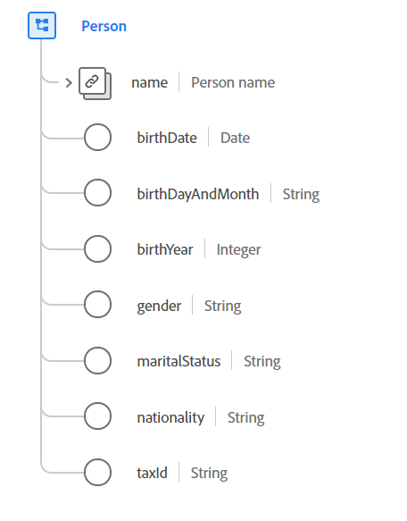

# Type de données [!UICONTROL Person]

[!UICONTROL Person] est un type de données standard du modèle de données d’expérience (XDM) qui décrit une personne individuelle. Ce type de données peut représenter une personne jouant différents rôles, tels qu’un client, un contact ou un propriétaire.

{width=500}

| Propriété | Type de données | Description |
| --- | --- | --- |
| `name` | [[!UICONTROL Person name]](./person-name.md) | Décrit les détails du nom complet de la personne. |
| `birthDate` | Date | Date de naissance complète d’une personne. Le format de la date (sans l’heure) doit suivre la norme [RFC 3339, section 5.6](https://tools.ietf.org/html/rfc3339#section-5.6). |
| `birthDayAndMonth` | Chaîne | Jour et mois de naissance d’une personne, au format MM-JJ. Ce champ doit être utilisé lorsque le jour et le mois de naissance d’une personne sont connus, mais pas l’année. Le format de cette propriété doit être conforme à ce `[0-1][0-9]-[0-9][0-9]` d’expression régulière. |
| `birthYear` | Entier | Année de naissance de la personne, y compris le siècle (par exemple, `1983`). Ce champ doit être utilisé lorsque seul l’âge de la personne est connu et non sa date de naissance complète. Cette valeur doit être comprise entre 1 et 32767. |
| `gender` | Chaîne | Identité sexuelle de la personne. La valeur de cette propriété doit être égale à l’une des valeurs d’énumération connues suivantes. <li> `female` </li> <li> `male` </li> <li> `not_specified` </li> <li> `non_specific` </li> La valeur par défaut de cette valeur est `not_specified`. |
| `maritalStatus` | Chaîne | Décrit la relation d’une personne avec une autre personne importante. La valeur de cette propriété doit être égale à l’une des valeurs d’énumération suivantes. <li> `married` </li> <li> `single` </li> <li> `divorced` </li> <li> `widowed` </li> <li> `not_specified` </li> La valeur par défaut de cette valeur est `not_specified`. |
| `nationality` | Chaîne | Relation juridique entre une personne et son état représenté à l’aide du code ISO 3166-1 Alpha-2. Le format de cette propriété doit être conforme à ce `^[A-Z]{2}$` d’expression régulière. |
| `taxId` | Chaîne | L’identifiant fiscal ou fiscal de la personne, tel que le numéro d’identification du contribuable (TIN) aux États-Unis ou le Certificado de Identificación Fiscal (CIF/NIF) en Espagne. |

{style="table-layout:auto"}

Pour plus d’informations sur ce type de données, reportez-vous au référentiel XDM public :

* [Exemple renseigné](https://github.com/adobe/xdm/blob/master/components/datatypes/person/person.example.1.json)
* [Schéma complet](https://github.com/adobe/xdm/blob/master/components/datatypes/person/person.schema.json)
