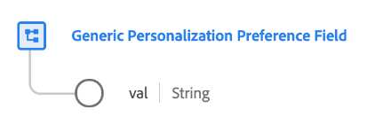

# [!UICONTROL Champ de préférence Personalization générique] type de données

Le [!UICONTROL champ de préférence Personalization générique] est un type de données XDM standard qui décrit la sélection d’une préférence de personnalisation particulière par un client.

>[!NOTE]
>
>Ce type de données est destiné à être utilisé pour personnaliser la structure des schémas de consentement de votre organisation à l’aide du groupe de champs [[!UICONTROL Consentements et préférences] comme ligne de base](../field-groups/profile/consents.md).

| Propriété | Type de données | Description |
| --- | --- | --- |
| `val` | Chaîne | Choix de préférence fourni par le client pour ce cas d’utilisation de la personnalisation. Consultez le tableau ci-dessous pour connaître les valeurs et définitions acceptées. |

{style="table-layout:auto"}

Le tableau suivant décrit les valeurs acceptées pour `val` :

| Valeur | Titre | Description |
| --- | --- | --- |
| `y` | Oui (opt-in) | Le client a choisi la préférence. En d&#39;autres termes, ils **consentent** à l&#39;utilisation de leurs données comme indiqué par la préférence en question. |
| `n` | Non (opt-out) | Le client s’est désabonné de la préférence. En d&#39;autres termes, ils **ne consentent pas** à l&#39;utilisation de leurs données comme indiqué par la préférence en question. |
| `p` | En attente de vérification | Le système n&#39;a pas encore reçu de valeur de préférence finale. Elle est le plus souvent utilisée dans le cadre d’un consentement qui nécessite une vérification en deux étapes. Par exemple, si un client ou une cliente accepte de recevoir des e-mails, ce consentement est défini sur `p` jusqu’à ce qu’il ou elle sélectionne un lien dans un e-mail pour vérifier qu’il ou elle a fourni la bonne adresse e-mail. À ce stade, le consentement est mis à jour sur `y`.   Si cette préférence n’utilise pas de processus de vérification à deux ensembles, le choix `p` peut plutôt être utilisé pour indiquer que le client ou la cliente n’a pas encore répondu à l’invite de consentement. Par exemple, vous pouvez définir automatiquement la valeur sur `p` sur la première page d’un site web, avant que le client n’ait répondu à l’invite de consentement. Dans les juridictions qui n’exigent pas de consentement explicite, vous pouvez également l’utiliser pour indiquer que le client ne s’est pas explicitement opposé (en d’autres termes, le consentement est présumé). |
| `u` | Inconnu | Les informations sur les préférences du client sont inconnues. |
| `dy` | Valeur par défaut de Oui (opt-in) | Le client n&#39;a pas fourni lui-même de valeur de consentement et est traité par défaut comme un accord préalable (« Oui »). En d’autres termes, le consentement est présumé jusqu’à ce que le client indique le contraire.  Notez que si des lois ou des modifications apportées à la politique de confidentialité de votre entreprise entraînent des modifications des valeurs par défaut de certains utilisateurs ou de tous les utilisateurs, vous devez mettre à jour manuellement tous les profils contenant des valeurs par défaut. |
| `dn` | Valeur par défaut de Non (opt-out) | Le client n&#39;a pas fourni lui-même de valeur de consentement et est traité par défaut comme un désabonnement (« Non »). En d’autres termes, le client est présumé avoir refusé son consentement jusqu’à ce qu’il indique le contraire.  Notez que si des lois ou des modifications apportées à la politique de confidentialité de votre entreprise entraînent des modifications des valeurs par défaut de certains utilisateurs ou de tous les utilisateurs, vous devez mettre à jour manuellement tous les profils contenant des valeurs par défaut. |
| `LI` | Intérêt Légitime | L’intérêt commercial légitime de collecter et de traiter ces données à des fins spécifiques l’emporte sur le préjudice potentiel qu’elles peuvent causer à la personne concernée. |
| `CT` | Contrat | La collecte de données à des fins précises est nécessaire pour respecter les obligations contractuelles avec la personne concernée. |
| `CP` | Respect d&#39;une obligation légale | La collecte de données à des fins précises est nécessaire pour respecter les obligations légales de l&#39;entreprise. |
| `VI` | Intérêt vital de l&#39;individu | La collecte de données aux fins spécifiées est nécessaire pour protéger les intérêts vitaux de l&#39;individu. |
| `PI` | Intérêt Public | La collecte de données à des fins spécifiques est nécessaire à l&#39;exécution d&#39;une mission d&#39;intérêt public ou dans l&#39;exercice de l&#39;autorité publique. |

{style="table-layout:auto"}

Pour plus d’informations sur ce type de données, reportez-vous au référentiel XDM public :

* [Exemple renseigné](https://github.com/adobe/xdm/blob/master/components/datatypes/consent/personalization-field.example.1.json)
* [Schéma complet](https://github.com/adobe/xdm/blob/master/components/datatypes/consent/personalization-field.schema.json)
