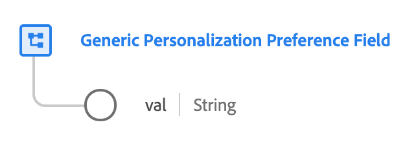

# Type de données [!UICONTROL Generic Personalization Preference Field]

[!UICONTROL Generic Personalization Preference Field] est un type de données XDM standard qui décrit la sélection d’un client pour une préférence de personnalisation spécifique.

>[!NOTE]
>
>Ce type de données est conçu pour être utilisé pour personnaliser la structure des schémas de consentement de votre organisation à l’aide du groupe de champs [[!UICONTROL Contenus et Préférences]](../field-groups/profile/consents.md) comme ligne de base.

| Propriété | Type de données | Description |
| --- | --- | --- |
| `val` | Chaîne | Choix des préférences fournies par le client pour ce cas d’utilisation de la personnalisation. Consultez le tableau ci-dessous pour connaître les valeurs et définitions acceptées. |

{style="table-layout:auto"}

Le tableau suivant décrit les valeurs acceptées pour `val` :

| Valeur | Titre | Description |
| --- | --- | --- |
| `y` | Oui (inclusion) | Le client a choisi la préférence. En d’autres termes, ils **font** consentent à l’utilisation de leurs données comme indiqué par la préférence en question. |
| `n` | Non (opt-out) | Le client s’est désinscrit de la préférence. En d’autres termes, ils **ne consentent pas** à l’utilisation de leurs données comme indiqué par la préférence en question. |
| `p` | En attente de vérification | Le système n’a pas encore reçu de valeur de préférence finale. Il est le plus souvent utilisé dans le cadre d’un consentement qui nécessite une vérification en deux étapes. Par exemple, si un client choisit de recevoir des emails, ce consentement est défini sur `p` jusqu’à ce qu’il sélectionne un lien dans un email pour vérifier qu’il a fourni l’adresse email correcte, auquel moment le consentement sera mis à jour sur `y`.  Si cette préférence n’utilise pas de processus de vérification à deux ensembles, le choix `p` peut être utilisé à la place pour indiquer que le client n’a pas encore répondu à l’invite de consentement. Par exemple, vous pouvez définir automatiquement la valeur sur `p` sur la première page d’un site web avant que le client n’ait répondu à l’invite de consentement. Dans les juridictions qui ne requièrent pas de consentement explicite, vous pouvez également l’utiliser pour indiquer que le client n’a pas explicitement exercé son droit d’opposition (en d’autres termes, le consentement est supposé). |
| `u` | Inconnu | Les informations de préférence du client sont inconnues. |
| `dy` | Par défaut : Oui (inclusion) | Le client n’a pas fourni de valeur de consentement lui-même et est traité comme un accord préalable (&quot;Oui&quot;) par défaut. En d’autres termes, le consentement est supposé jusqu’à ce que le client indique le contraire.  Notez que si des lois ou des modifications apportées à la politique de confidentialité de votre entreprise entraînent des modifications des valeurs par défaut de certains utilisateurs ou de tous les utilisateurs, vous devez mettre à jour manuellement tous les profils contenant des valeurs par défaut. |
| `dn` | Non par défaut (opt-out) | Le client n’a pas fourni de valeur de consentement lui-même et est traité comme un droit d’opposition (&quot;Non&quot;) par défaut. En d’autres termes, le client est supposé avoir refusé le consentement jusqu’à ce qu’il en indique autrement.  Notez que si des lois ou des modifications apportées à la politique de confidentialité de votre entreprise entraînent des modifications des valeurs par défaut de certains utilisateurs ou de tous les utilisateurs, vous devez mettre à jour manuellement tous les profils contenant des valeurs par défaut. |
| `LI` | L&#39;intérêt légitime | L’intérêt commercial légitime de collecter et de traiter ces données à des fins spécifiées l’emporte sur le préjudice potentiel qu’elles peuvent causer à l’individu. |
| `CT` | Contrat | La collecte de données aux fins spécifiées est nécessaire pour respecter les obligations contractuelles avec l’individu. |
| `CP` | Respect d’une obligation juridique | La collecte de données aux fins spécifiées est nécessaire pour respecter les obligations légales de l’entreprise. |
| `VI` | Intérêt vital de l’individu | La collecte de données aux fins spécifiées est nécessaire pour protéger les intérêts vitaux de l’individu. |
| `PI` | Intérêt public | La collecte de données aux fins spécifiées est nécessaire pour effectuer une tâche dans l’intérêt public ou dans l’exercice de l’autorité officielle. |

{style="table-layout:auto"}

Pour plus d’informations sur le type de données, reportez-vous au référentiel XDM public :

* [Exemple renseigné](https://github.com/adobe/xdm/blob/master/components/datatypes/consent/personalization-field.example.1.json)
* [Schéma complet](https://github.com/adobe/xdm/blob/master/components/datatypes/consent/personalization-field.schema.json)
