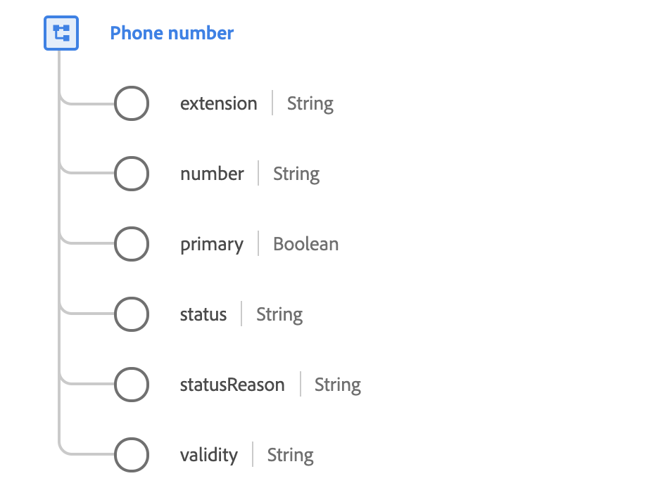

# Type de données [!UICONTROL Phone number]

[!UICONTROL Phone number] est un type de données XDM standard qui décrit les détails d’un numéro de téléphone.

{width=600}

| Propriété | Description |
| --- | --- |
| `extension` | Numéro d’appel interne utilisé pour appeler à partir d’un central privé, d’un opérateur ou d’un standard. |
| `number` | Numéro de téléphone. Notez que le numéro de téléphone est une chaîne et peut inclure des caractères significatifs tels que des crochets `()`, des tirets `-` ou des caractères pour indiquer des identifiants de sous-numérotation tels que des extensions `x` par exemple `1-353(0)18391111` ou `+613 9403600x1234`. |
| `primary` | Valeur booléenne qui indique s’il s’agit du numéro de téléphone principal de l’individu. Contrairement à l’adresse ou à l’adresse e-mail, il peut y avoir plusieurs numéros de téléphone principaux ; un par canal de communication. Le canal de communication est défini par le type (indiqué par le nom de la propriété parent) : `textMessaging`, `mobile`, `phone`, `home`, `work`, `unknown` et `fax`. |
| `status` | Indique si le numéro de téléphone peut actuellement être utilisé. |
| `statusReason` | Description de l’état actuel. |
| `validity` | Niveau de précision technique du numéro de téléphone. |

{style="table-layout:auto"}

Pour plus d’informations sur le type de données de numéro de téléphone, reportez-vous au référentiel XDM public :

* [Exemple renseigné](https://github.com/adobe/xdm/blob/master/components/datatypes/demographic/phonenumber.example.1.json)
* [Schéma complet](https://github.com/adobe/xdm/blob/master/components/datatypes/demographic/phonenumber.schema.json)
