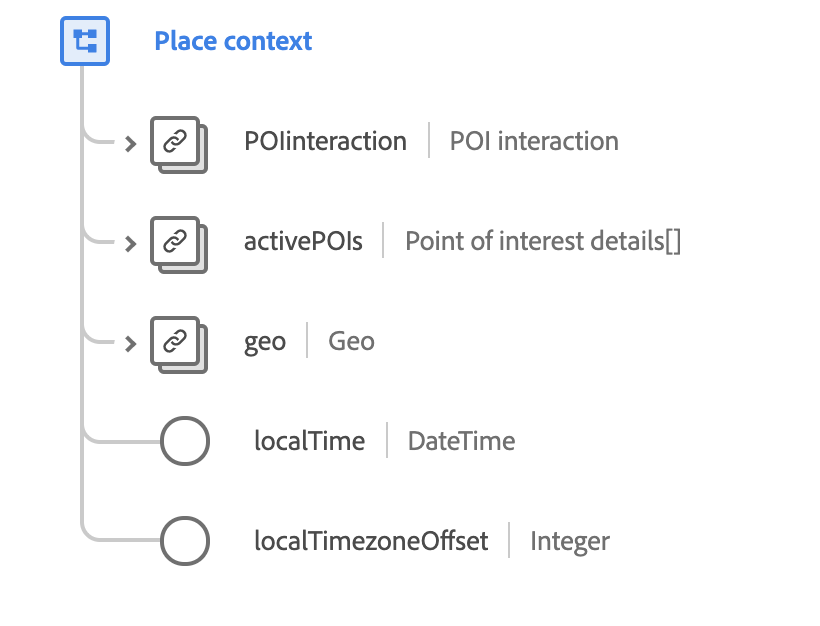

# Type de données [!UICONTROL Place context]

[!UICONTROL Place context] est un type de données XDM standard qui décrit le lieu d’un événement observé, y compris les informations sur le point ciblé et les coordonnées géographiques.

{width=500}

| Propriété | Type de données | Description |
| --- | --- | --- |
| `POIinteraction` | [[!UICONTROL Point of interest interaction]](./poi-interaction.md) | Décrit en détail l’interaction avec le point d’intérêt. |
| `activePOIs` | Tableau de [[!UICONTROL Point of interest details]](./poi-details.md) | Décrit les points d’intérêt qui ont provoqué l’événement. |
| `geo` | [[!UICONTROL Geo]](./geo.md) | Décrit l’emplacement géographique où l’expérience a été diffusée. |
| `localTime` | DateTime | Horodatage au format [RFC 3339](https://tools.ietf.org/html/rfc3339) indiquant l’heure locale à l’aide de avec un décalage de fuseau horaire indiqué. Le modèle de mise en forme est `yyyy-MM-dd'T'HH:mm:ssXXX` (par exemple, `2001-07-04T12:08:56-07:00`). |
| `localTimezoneOffset` | Entier | Décalage horaire local actuel en minutes par rapport à UTC pour la valeur `localTime`. Cela doit inclure le décalage DST actuel, le cas échéant. |

{style="table-layout:auto"}

Pour plus d’informations sur ce type de données, reportez-vous au référentiel XDM public :

* [Exemple renseigné](https://github.com/adobe/xdm/blob/master/components/datatypes/placecontext.example.1.json)
* [Schéma complet](https://github.com/adobe/xdm/blob/master/components/datatypes/placecontext.schema.json)
