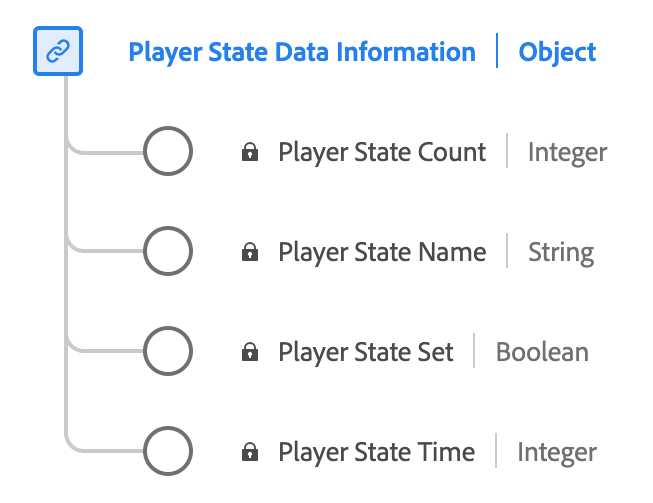

# Type de données [!UICONTROL Player State Data Reporting]

[!UICONTROL Player State Data Reporting] est un type de données standard du modèle de données d’expérience (XDM) qui décrit les différents états et leurs occurrences dans un lecteur multimédia. Utilisez le type de données [!UICONTROL Player State Data Reporting] pour capturer différents états du lecteur, tels que le plein écran, le mode muet, le sous-titrage, l’image dans l’image et les états de mise au point. Pour chaque état, il enregistre si l’état est défini, le nombre d’occurrences et la durée totale pendant laquelle il reste actif pendant la lecture du média.

| Nom d’affichage | Propriété | Type de données | Description |
|-------------------|----------------|-----------|----------------------------------------------|
| [!UICONTROL Player State Name] | `name` | chaîne | Nom de l’état du lecteur. Énumérées : « fullscreen », « mute », « closeCaptioning », « pictureInPicture », « inFocus » avec leurs significations respectives. |
| [!UICONTROL Player State Set] | `isSet` | booléen | Indique si l’état du lecteur est défini sur cet état. |
| [!UICONTROL Player State Count] | `count` | entier | Nombre de fois que l’état du lecteur a été défini sur le flux. |
| [!UICONTROL Player State Time] | `time` | entier | Durée totale de cet état de lecteur. |

{style="table-layout:auto"}

Pour plus d’informations sur le groupe de champs , consultez le [référentiel XDM public](https://github.com/adobe/xdm/blob/master/components/datatypes/playerstatedata.schema.json)
