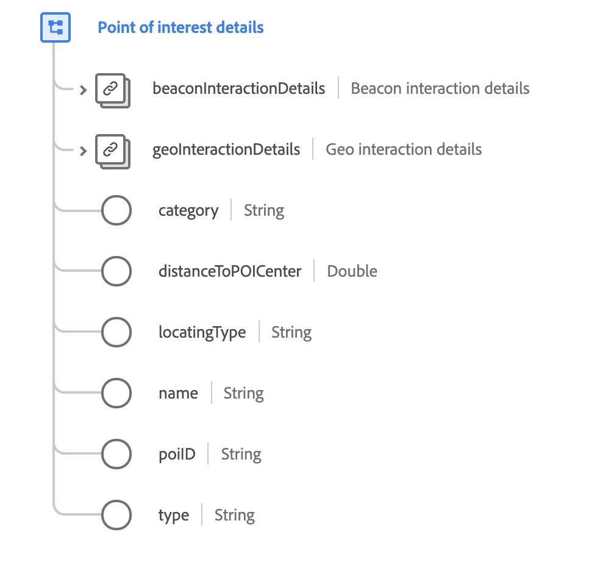

# [!UICONTROL Détails du point ciblé] type de données

[!UICONTROL Détails du point ciblé] est un type de données XDM standard qui décrit les données géographiques où un événement a été observé.

{width=550}

| Propriété | Type de données | Description |
| --- | --- | --- |
| `beaconInteractionDetails` | [[!UICONTROL Balise]](./beacon.md) | Décrit les détails de balise actifs pour l’interaction avec le point d’intérêt. |
| `geoInteractionDetails` | [[!UICONTROL Détails de l’interaction géographique]](./geo-interaction-details.md) | Décrit les détails géographiques actifs pour l’interaction avec le point d’intérêt. |
| `category` | Chaîne | Catégorie générale affectée à l’organisation des points d’intérêt par l’administrateur des définitions de points d’intérêt. |
| `distanceToPOICenter` | Double | Distance estimée par rapport au centre du point d’intérêt, en mètres. |
| `locatingType` | Chaîne | Mécanisme utilisé pour déterminer l’emplacement. Les valeurs acceptées sont les suivantes : <ul><li>`beacon`</li><li>`gps`</li><li>`ip`</li><li>`ip+wifi`</li><li>`wifi-triangulation`</li></ul> |
| `name` | Chaîne | Nom donné au point d’intérêt. |
| `poiID` | Chaîne | Identifiant unique du point d’intérêt. |
| `type` | Chaîne | Type général du point ciblé qui utilise un schéma de saisie sélectionné par l’administrateur des définitions des points ciblés. |

{style="table-layout:auto"}

Pour plus d’informations sur ce type de données, reportez-vous au référentiel XDM public :

* [Exemple renseigné](https://github.com/adobe/xdm/blob/master/components/datatypes/poi-detail.example.1.json)
* [Schéma complet](https://github.com/adobe/xdm/blob/master/components/datatypes/poi-detail.schema.json)
