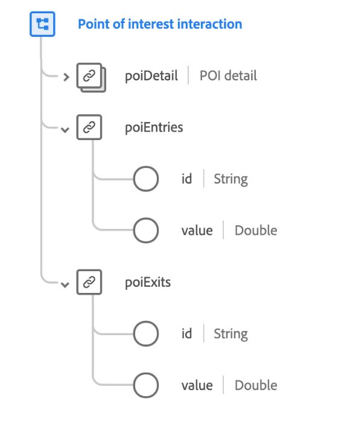

# [!UICONTROL Interaction du point ciblé] type de données

[!UICONTROL Interaction de point ciblé] est un type de données XDM standard qui décrit l’appareil sans fil qui communique des informations d’identité aux applications mobiles lorsque des appareils mobiles arrivent à portée.

{width=400}

| Propriété | Type de données | Description |
| --- | --- | --- |
| `poiDetail` | [[!UICONTROL Détails du point ciblé]](./poi-details.md) | Décrit les détails du point d’intérêt qui a provoqué l’événement. |
| `poiEntries` | Objet | Décrit le nombre de fois qu’une personne a accédé au point d’intérêt. Contient deux propriétés : <ul><li>`id` : identifiant unique de la mesure.</li><li>`value` : valeur quantifiable de la mesure.</li></ul> |
| `poiExits` | Objet | Décrit le nombre de fois qu’une personne a quitté le point d’intérêt. Contient deux propriétés : <ul><li>`id` : identifiant unique de la mesure.</li><li>`value` : valeur quantifiable de la mesure.</li></ul> |

{style="table-layout:auto"}

Pour plus d’informations sur ce type de données, reportez-vous au référentiel XDM public :

* [Exemple renseigné](https://github.com/adobe/xdm/blob/master/components/datatypes/deprecated/poi-interaction.example.1.json)
* [Schéma complet](https://github.com/adobe/xdm/blob/master/components/datatypes/deprecated/poi-interaction.schema.json)
