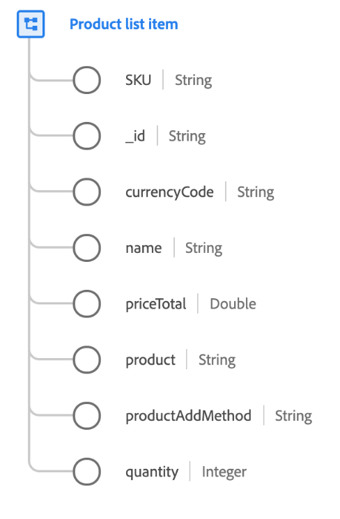

# [!UICONTROL Élément de liste de produits] type de données

[!UICONTROL Élément de liste de produits] est un type de données XDM standard qui décrit un produit sélectionné par un client avec des options, un prix et un contexte d’utilisation spécifiques pour un moment spécifique.

Les valeurs capturées dans ce type de données peuvent différer de l’enregistrement du produit. Par exemple, l’enregistrement du produit contient des détails du système d’information sur les produits qui sont cohérents pour tous les clients, où l’élément de liste de produits comporte le prix réel proposé au client au moment de l’achat, qui peut varier en raison des campagnes de vente ou de la tarification saisonnière.

| Propriété | Type de données | Description |
| --- | --- | --- |
| `selectedOptions` | Tableau d’objets | Contient des options personnalisées sélectionnées pour un produit configurable. Chaque élément de liste est un objet avec les propriétés suivantes :<ul><li>`attribute` : nom de l’attribut configurable.</li><li>`value` : valeur de l’attribut .</li></ul> |
| `SKU` | [!UICONTROL Chaîne] | Unité de stock (SKU), identifiant unique d’un produit défini par le fournisseur. |
| `_id` | [!UICONTROL Chaîne] | Identifiant d&#39;élément de ligne pour cette entrée de produit. Le produit lui-même est identifié par `product`. |
| `currencyCode` | [!UICONTROL Chaîne] | Code de devise alphabétique [ISO 4217](https://www.iso.org/iso-4217-currency-codes.html) utilisé pour la tarification du produit. |
| `discountAmount` | [!UICONTROL Double] | Si le produit fait l&#39;objet d&#39;une remise, cela représente la différence entre le prix normal et le prix spécial du produit. |
| `name` | [!UICONTROL Chaîne] | Nom d’affichage du produit tel qu’il est présenté à l’utilisateur pour cette vue de produit. |
| `priceTotal` | [!UICONTROL Double] | Prix total de l’élément de ligne du produit. |
| `product` | [!UICONTROL Chaîne] (URI) | Identifiant XDM du produit lui-même. |
| `productAddMethod` | [!UICONTROL Chaîne] | Méthode utilisée par le visiteur pour ajouter un produit à la liste. |
| `productImageUrl` | [!UICONTROL Chaîne] | URL de l’image principale du produit. |
| `quantity` | [!UICONTROL Entier] | Nombre d’unités du produit que le client a indiqué. |
| `unitOfMeasureCode` | [!UICONTROL Chaîne] | Code [unité de mesure](https://ucum.org/ucum) standard du produit tel qu&#39;il est associé à la propriété `quantity`. |

{style="table-layout:auto"}

Pour plus d’informations sur le type de données d’adresse postale, consultez le référentiel XDM public :

* [Exemple renseigné](https://github.com/adobe/xdm/blob/master/components/datatypes/productlistitem.example.1.json)
* [Schéma complet](https://github.com/adobe/xdm/blob/master/components/datatypes/productlistitem.schema.json)
