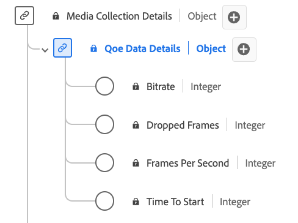

# Type de données de collecte des détails de données QoE (qualité de l’expérience)

La collecte de [!UICONTROL QoE Data Details] est un type de données standard du modèle de données d’expérience (XDM) qui fournit des mesures détaillées liées à la qualité de l’expérience (QoE) pendant la lecture de médias. Utilisez le type de données [!UICONTROL QoE Data Details] Collection pour capturer des informations telles que les informations sur le débit binaire, les débits d’images, les événements de mise en mémoire tampon, les images perdues, etc. Ce type de données permet d’analyser la qualité de la lecture, ce qui permet d’obtenir des informations sur les performances de diffusion en continu, l’expérience utilisateur et les problèmes potentiels rencontrés lors des sessions de lecture.

>[!NOTE]
>
>Ce type de données appartient au schéma `mediaCollection`, à savoir les champs que votre implémentation envoie au serveur principal des médias en flux continu. Adobe traite ces données et génère les champs de `mediaReporting` correspondants, qui sont ingérés dans les jeux de données Platform. Voir [Schéma de reporting XDM des médias en flux continu](https://experienceleague.adobe.com/fr/docs/media-analytics/using/implementation/edge/reporting-schema) pour plus d’informations.

>[!NOTE]
>
>Ce type de données capture uniquement les quatre champs envoyés par l’implémenteur. Adobe calcule des agrégats QoE supplémentaires (notamment le débit moyen, le nombre de tampons, les événements de blocage, le nombre d’erreurs et les mesures de flux affectées) à partir des données d’événement au cours de la session. Ces champs calculés sont disponibles dans le type de données [Rapports sur les détails des données QoE](./qoe-data-details-reporting.md).

+++Sélectionnez cette option pour afficher le type de données Détails des données QoE .

+++

Chaque nom d’affichage contient un lien vers des informations supplémentaires sur sa variable d’implémentation. Les pages liées contiennent des détails sur les données collectées par Adobe, les valeurs d’implémentation, les paramètres réseau et des considérations importantes.

| Nom d’affichage | Propriété | Type de données | Obligatoire | Description |
|---|---|---|---|---|
| [[!UICONTROL Bitrate]](https://experienceleague.adobe.com/fr/docs/media-analytics/using/implementation/variables/quality/bitrate) | `bitrate` | entier | Non | Valeur du débit (en Kbits/s). |
| [[!UICONTROL Dropped Frames]](https://experienceleague.adobe.com/fr/docs/media-analytics/using/implementation/variables/quality/dropped-frames) | `droppedFrames` | entier | Non | Nombre total d’images perdues lors de la lecture. |
| [[!UICONTROL Frames Per Second]](https://experienceleague.adobe.com/fr/docs/media-analytics/using/implementation/variables/quality/frames-per-second) | `framesPerSecond` | entier | Non | Débit d&#39;images du flux actuel (en images par seconde). |
| [[!UICONTROL Time To Start]](https://experienceleague.adobe.com/fr/docs/media-analytics/using/implementation/variables/quality/time-to-start) | `timeToStart` | entier | Non | Durée (en secondes) entre le chargement et le démarrage de la vidéo. |
