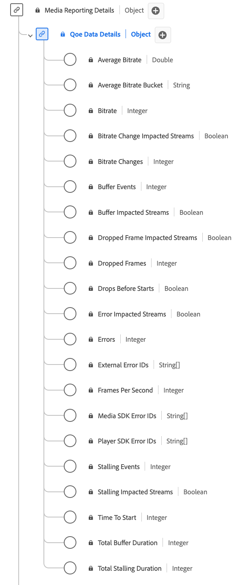

# Détails des données QoE (qualité de l’expérience) Type de données de rapport

[!UICONTROL QoE Data Details] création de rapports est un type de données XDM (Modèle de données d’expérience) standard qui fournit des mesures détaillées liées à la qualité de l’expérience (QoE) pendant la lecture de médias. Utilisez le type de données [!UICONTROL QoE Data Details] Reporting pour capturer des informations telles que les informations de débit binaire, les débits d’images, les événements de mise en mémoire tampon, les images perdues, etc. Les champs de création de rapports multimédia sont utilisés par les services Adobe pour analyser les champs de collecte multimédia envoyés par les utilisateurs. Ces données, ainsi que d’autres mesures d’utilisateur spécifiques, sont calculées et font l’objet de rapports. Ce type de données permet d’analyser la qualité de la lecture, ce qui permet d’obtenir des informations sur les performances de diffusion en continu, l’expérience utilisateur et les problèmes potentiels rencontrés lors des sessions de lecture.

+++Sélectionnez cette option pour afficher le type de données Rapports sur les détails des données QoE .

+++

>[!NOTE]
>
>Chaque nom d’affichage contient un lien vers des informations supplémentaires sur ses paramètres audio et vidéo. Les pages liées contiennent des détails sur la vidéo et les données collectées par Adobe, les valeurs d’implémentation, les paramètres réseau, les rapports et des considérations importantes.

| Nom d’affichage | Propriété | Type de données | Description |
|----------------------------------------------------------------------------------------------------------------------------------------------------------------------------------------------|--------------------------|-----------|---------------------------------------------------------------------------------------------------|
| [[!UICONTROL Average Bitrate]](https://experienceleague.adobe.com/docs/media-analytics/using/implementation/variables/quality-parameters.html?lang=fr#average-bitrate-1) | `bitrateAverage` | nombre | Débit moyen (en Kbits/s, entier). Calculé en tant que moyenne pondérée des valeurs de débit. |
| [[!UICONTROL Average Bitrate Bucket]](https://experienceleague.adobe.com/docs/media-analytics/using/implementation/variables/quality-parameters.html?lang=fr#average-bitrate) | `bitrateAverageBucket` | chaîne | Débit moyen (en Kbits/s) classé par intervalles prédéfinis à 100 Kbits/s. |
| [[!UICONTROL Bitrate]](https://experienceleague.adobe.com/docs/media-analytics/using/implementation/variables/quality-parameters.html?lang=fr#average-bitrate) | `bitrate` | entier | Valeur du débit (en Kbits/s). |
| [[!UICONTROL Bitrate Change Impacted Streams]](https://experienceleague.adobe.com/docs/media-analytics/using/implementation/variables/quality-parameters.html?lang=fr#bitrate-change-impacted-streams) | `hasBitrateChangeImpactedStreams` | booléen | Indique si les flux ont été affectés par les modifications de débit lors de la lecture. |
| [[!UICONTROL Bitrate Changes]](https://experienceleague.adobe.com/docs/media-analytics/using/implementation/variables/quality-parameters.html?lang=fr#bitrate-changes) | `bitrateChangeCount` | entier | Nombre total de modifications du débit au cours de la lecture. |
| [[!UICONTROL Buffer Events]](https://experienceleague.adobe.com/docs/media-analytics/using/implementation/variables/quality-parameters.html?lang=fr#buffer-events) | `bufferCount` | entier | Nombre de différents états de mémoire tampon pendant la lecture. |
| [[!UICONTROL Buffer Impacted Streams]](https://experienceleague.adobe.com/docs/media-analytics/using/implementation/variables/quality-parameters.html?lang=fr#buffer-impacted-streams) | `hasBufferImpactedStreams` | booléen | Indique si les flux ont été affectés par la mise en mémoire tampon lors de la lecture. |
| [[!UICONTROL Dropped Frame Impacted Streams]](https://experienceleague.adobe.com/docs/media-analytics/using/implementation/variables/quality-parameters.html?lang=fr#dropped-frame-impacted-streams) | `hasDroppedFrameImpactedStreams` | booléen | Indique si les flux ont été impactés par des images perdues lors de la lecture. |
| [[!UICONTROL Dropped Frames]](https://experienceleague.adobe.com/docs/media-analytics/using/implementation/variables/quality-parameters.html?lang=fr#dropped-frames-1) | `droppedFrames` | entier | Nombre total d’images perdues lors de la lecture. |
| [[!UICONTROL Drops Before Starts]](https://experienceleague.adobe.com/docs/media-analytics/using/implementation/variables/quality-parameters.html?lang=fr#drops-before-start) | `isDroppedBeforeStart` | booléen | Indique si les utilisateurs quittent la vidéo avant son démarrage, quelles que soient les publicités. |
| [[!UICONTROL Error Impacted Streams]](https://experienceleague.adobe.com/docs/media-analytics/using/implementation/variables/quality-parameters.html?lang=fr#error-impacted-streams) | `hasErrorImpactedStreams` | booléen | Indique si des flux ont rencontré des erreurs lors de la lecture. |
| [[!UICONTROL Errors]](https://experienceleague.adobe.com/docs/media-analytics/using/implementation/variables/quality-parameters.html?lang=fr#errors-%2F-error-events) | `errorCount` | entier | Nombre total d’erreurs qui se sont produites lors de la lecture. |
| [[!UICONTROL External Error IDs]](https://experienceleague.adobe.com/docs/media-analytics/using/implementation/variables/quality-parameters.html?lang=fr#external-error-ids) | `externalErrors` | tableau de chaînes | ID d’erreur uniques provenant de sources externes, par exemple, erreurs CDN. |
| [[!UICONTROL Frames Per Second]](https://experienceleague.adobe.com/docs/media-analytics/using/implementation/variables/quality-parameters.html?lang=fr#frames-per-second) | `framesPerSecond` | entier | Débit d&#39;images du flux actuel (en images par seconde). |
| [[!UICONTROL Media SDK Error IDs]](https://experienceleague.adobe.com/docs/media-analytics/using/implementation/variables/quality-parameters.html?lang=fr#media-sdk-error-ids) | `mediaSdkErrors` | tableau de chaînes | ID d’erreur uniques générés par Media SDK lors de la lecture. |
| [[!UICONTROL Player SDK Error IDs]](https://experienceleague.adobe.com/docs/media-analytics/using/implementation/variables/quality-parameters.html?lang=fr#player-sdk-error-ids) | `playerSdkErrors` | tableau de chaînes | ID d’erreur uniques générés par le SDK du lecteur lors de la lecture. |
| [[!UICONTROL Stalling Events]](https://experienceleague.adobe.com/docs/media-analytics/using/implementation/variables/quality-parameters.html?lang=fr#stalling-events) | `stallCount` | entier | Nombre d’événements qui bloquent la lecture. |
| [[!UICONTROL Stalling Impacted Streams]](https://experienceleague.adobe.com/docs/media-analytics/using/implementation/variables/quality-parameters.html?lang=fr#stalling-impacted-streams) | `hasStallImpactedStreams` | booléen | Indique si des flux ont été bloqués lors de la lecture. |
| [[!UICONTROL Time To Start]](https://experienceleague.adobe.com/docs/media-analytics/using/implementation/variables/quality-parameters.html?lang=fr#time-to-start-1) | `timeToStart` | entier | Durée (en secondes) entre le chargement et le démarrage de la vidéo. |
| [[!UICONTROL Total Buffer Duration]](https://experienceleague.adobe.com/docs/media-analytics/using/implementation/variables/quality-parameters.html?lang=fr#total-buffer-duration-1) | `bufferTime` | entier | Temps total (en secondes) passé à mettre en mémoire tampon pendant la lecture. |
| [[!UICONTROL Total Stalling Duration]](https://experienceleague.adobe.com/docs/media-analytics/using/implementation/variables/quality-parameters.html?lang=fr#total-stalling-duration) | `stallTime` | entier | Durée totale (en secondes) pendant laquelle la lecture a été bloquée. |

{style="table-layout:auto"}
