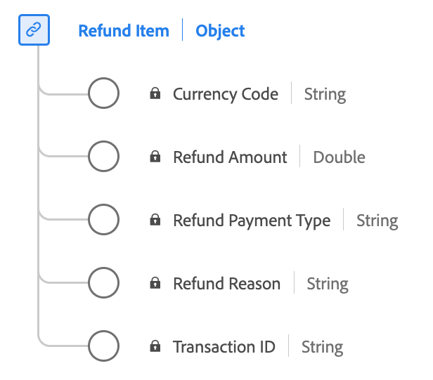

# Type de données [!UICONTROL Refund Item]

[!UICONTROL Article remboursé] est un type de données XDM (Experience Data Model) standard qui décrit la capture des informations liées à un remboursement associé à une commande.

| Nom d’affichage | Propriété | Type de données | Description |
|--------------------|-----------------------|-----------|---------------------------------------------------------------------------------------------------|
| [!UICONTROL ID de transaction] | `transactionID` | Chaîne | Identifiant de transaction unique pour cet article de remboursement. |
| [!UICONTROL Montant de remboursement] | `refundAmount` | nombre | La valeur du remboursement. |
| [!UICONTROL Raison de remboursement] | `refundReason` | Chaîne | La raison pour laquelle un remboursement a été effectué. |
| [!UICONTROL Type de paiement de remboursement] | `refundPaymentType` | Chaîne | Mode de paiement pour cette commande. Les valeurs personnalisées sont autorisées. |
| [!UICONTROL Code de devise] | `currencyCode` | Chaîne | Code de devise ISO 4217 utilisé pour cet article de remboursement. Par exemple : &quot;USD&quot;, &quot;EUR&quot;. |

{style="table-layout:auto"}

Pour plus d’informations sur le type de données, reportez-vous au référentiel XDM public :

* [Exemple renseigné](https://github.com/adobe/xdm/blob/master/components/datatypes/refunditem.example.1.json)
* [Schéma complet](https://github.com/adobe/xdm/blob/master/components/datatypes/refunditem.schema.json)
