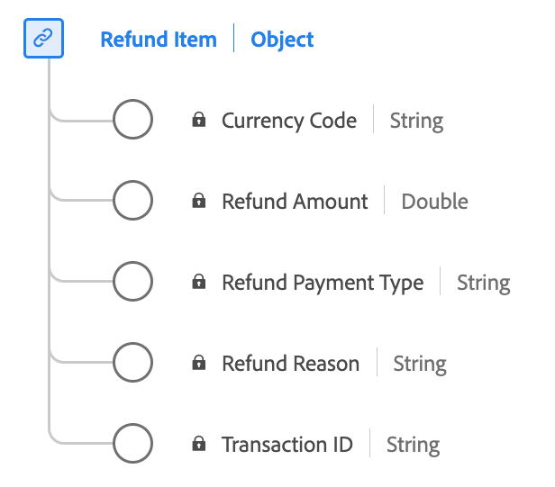

# Type de données [!UICONTROL Article remboursé]

[!UICONTROL Article remboursé] est un type de données standard du modèle de données d’expérience (XDM) qui décrit les informations relatives à un remboursement associé à une commande.

| Nom d’affichage | Propriété | Type de données | Description |
|--------------------|-----------------------|-----------|---------------------------------------------------------------------------------------------------|
| [!UICONTROL ID de transaction] | `transactionID` | chaîne | Identifiant de transaction unique pour cet article remboursé. |
| [!UICONTROL &#x200B; Montant du remboursement &#x200B;] | `refundAmount` | nombre | Valeur du remboursement. |
| [!UICONTROL Motif du remboursement] | `refundReason` | chaîne | Motif pour lequel un remboursement a été émis. |
| [!UICONTROL Type de paiement du remboursement] | `refundPaymentType` | chaîne | Mode de paiement pour cette commande. Les valeurs personnalisées sont autorisées. |
| [!UICONTROL Code de devise] | `currencyCode` | chaîne | Code de devise ISO 4217 utilisé pour cet élément de remboursement. Par exemple : « USD », « EUR ». |

{style="table-layout:auto"}

Pour plus d’informations sur ce type de données, reportez-vous au référentiel XDM public :

* [Exemple renseigné](https://github.com/adobe/xdm/blob/master/components/datatypes/refunditem.example.1.json)
* [Schéma complet](https://github.com/adobe/xdm/blob/master/components/datatypes/refunditem.schema.json)
