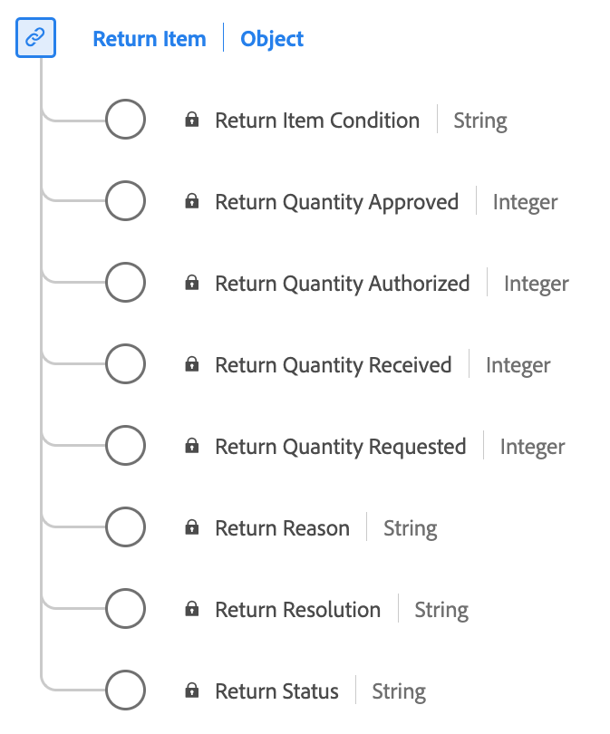

# Type de données [!UICONTROL Return Item]

[!UICONTROL Return Item] est un type de données standard du modèle de données d’expérience (XDM) qui capture les détails essentiels liés au processus de retour d’un article acheté.

| Nom d’affichage | Propriété | Type de données | Description |
|-----------------------------|------------------------------|-----------|--------------------------------------------------------|
| [!UICONTROL Return Status] | `returnStatus` | chaîne | Statut de l’élément renvoyé (par exemple, En attente ou Approuvé). |
| [!UICONTROL Return Reason] | `returnReason` | chaîne | Motif pour lequel le retour a été demandé pour l&#39;article. |
| [!UICONTROL Return Item Condition] | `returnItemCondition` | chaîne | Condition de l&#39;article pour lequel le retour est demandé. |
| [!UICONTROL Return Resolution] | `returnResolution` | chaîne | Résolution souhaitée ou résultat attendu du retour (par exemple, remboursement ou échange). |
| [!UICONTROL Return Quantity Requested] | `returnQuantityRequested` | entier | Quantité de l&#39;article que l&#39;acheteur a demandé de retourner. |
| [!UICONTROL Return Quantity Authorized] | `returnQuantityAuthorized` | entier | Quantité de l’article dont le retour est autorisé. |
| [!UICONTROL Return Quantity Received] | `returnQuantityReceived` | entier | Quantité d&#39;articles retournés reçue. |
| [!UICONTROL Return Quantity Approved] | `returnQuantityApproved` | entier | Quantité de l&#39;article avec un retour entièrement terminé et approuvé. |

{style="table-layout:auto"}

Pour plus d’informations sur ce type de données, reportez-vous au référentiel XDM public :

* [Exemple renseigné](https://github.com/adobe/xdm/blob/master/components/datatypes/returnitem.example.1.json)
* [Schéma complet](https://github.com/adobe/xdm/blob/master/components/datatypes/returnitem.schema.json)
