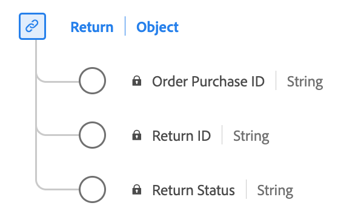

# Type de données [!UICONTROL Return]

[!UICONTROL Return] est un type de données XDM (Experience Data Model) standard qui capture les informations essentielles liées à une autorisation de marchandisage de retour (RMA).

| Nom d’affichage | Propriété | Type de données | Description |
|----------------------------------|----------------------|-----------|--------------------------------------------------|
| [!UICONTROL Identifiant de retour] | `returnID` | Chaîne | Identifiant unique de cette RAM. |
| [!UICONTROL Statut de retour] | `returnStatus` | Chaîne | État actuel de la RAM (par exemple, En attente ou Fermé). |
| [!UICONTROL ID d’achat de commande] | `purchaseID` | Chaîne | Identifiant unique de la commande/de l’achat auquel la RMA se rapporte. |

{style="table-layout:auto"}

Pour plus d’informations sur le type de données, reportez-vous au référentiel XDM public :

* [Exemple renseigné](https://github.com/adobe/xdm/blob/master/components/datatypes/return.example.1.json)
* [Schéma complet](https://github.com/adobe/xdm/blob/master/components/datatypes/return.schema.json)
