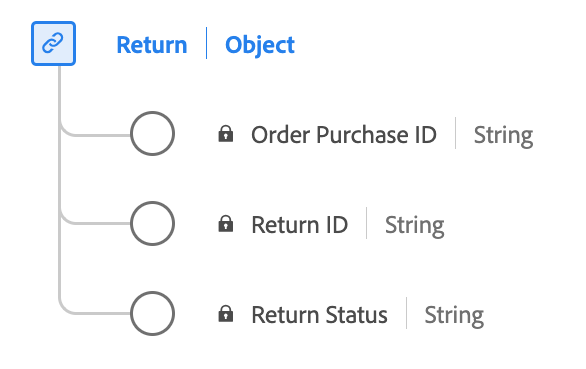

# Type de données [!UICONTROL Retour]

[!UICONTROL Retour] est un type de données standard du modèle de données d’expérience (XDM) qui capture les informations essentielles liées à une autorisation de retour de marchandise (RMA).

| Nom d’affichage | Propriété | Type de données | Description |
|----------------------------------|----------------------|-----------|--------------------------------------------------|
| [!UICONTROL ID de retour] | `returnID` | chaîne | Identifiant unique de ce RMA. |
| [!UICONTROL Statut de retour] | `returnStatus` | chaîne | Statut actuel du RMA (par exemple En attente ou Fermé). |
| [!UICONTROL ID achat de commande] | `purchaseID` | chaîne | Identifiant unique de la commande/de l&#39;achat auquel la RMA se rapporte. |

{style="table-layout:auto"}

Pour plus d’informations sur ce type de données, reportez-vous au référentiel XDM public :

* [Exemple renseigné](https://github.com/adobe/xdm/blob/master/components/datatypes/return.example.1.json)
* [Schéma complet](https://github.com/adobe/xdm/blob/master/components/datatypes/return.schema.json)
