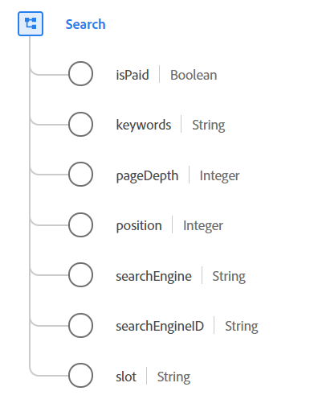

# Type de données [!UICONTROL Search]

[!UICONTROL Recherche] est un type de données standard du modèle de données d’expérience (XDM) qui contient des informations sur l’activité de recherche sur le web.

{width=500}

| Propriété | Type de données | Description |
| --- | --- | --- |
| `isPaid` | Booléen | Utilisé pour indiquer si la recherche est payante ou non. |
| `keywords` | Chaîne | Mots-clés de la recherche. |
| `pageDepth` | Entier | Profondeur de page dans les résultats de la recherche. |
| `position` | Entier | Position ou classement de la liste dans la page des résultats de recherche. |
| `searchEngine` | Chaîne | Moteur de recherche utilisé pour la recherche. |
| `searchEngineID` | Chaîne | Identifiant spécifique à l’application utilisé pour identifier le moteur de recherche. |
| `slot` | Chaîne | Section nommée de la page dans laquelle s’est affiché le résultat de la recherche. La valeur de cette propriété doit être égale à l’une des valeurs d’énumération connues que vous définissez, telles que `top`, `side` ou `bottom`. |

{style="table-layout:auto"}

Pour plus d’informations sur ce type de données, reportez-vous au référentiel XDM public :

* [Exemple renseigné](https://github.com/adobe/xdm/blob/master/components/datatypes/search.example.1.json)
* [Schéma complet](https://github.com/adobe/xdm/blob/master/components/datatypes/search.schema.json)
