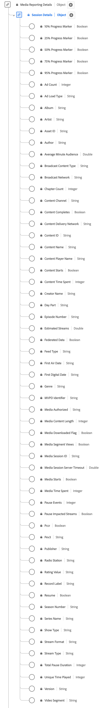

# [!UICONTROL Détails de la session] Type de données de rapport

[!UICONTROL Détails de session] la création de rapports est un type de données standard du modèle de données d’expérience (XDM) qui suit les données liées aux sessions de lecture de média. Le schéma englobe un large éventail de propriétés qui fournissent des informations sur le comportement des utilisateurs et les modèles de consommation de contenu. Utilisez le type de données [!UICONTROL Détails de la session] Rapports pour capturer l’interaction client en consignant les événements de lecture, les interactions publicitaires, les marqueurs de progression, les pauses et d’autres mesures.

+++Sélectionnez cette option pour afficher un diagramme du type de données Rapports sur les détails de session .

+++

>[!NOTE]
>
>Ce type de données appartient au schéma `mediaReporting` : champs calculés par le serveur principal des médias en flux continu à partir des données `mediaCollection` envoyées par votre implémentation. Il s’agit des champs qu’Adobe ingère dans les jeux de données Platform. Voir [Schéma de reporting XDM des médias en flux continu](https://experienceleague.adobe.com/en/docs/media-analytics/using/implementation/edge/reporting-schema) pour plus d’informations.

Chaque nom d’affichage contient un lien vers des informations supplémentaires sur sa dimension ou sa mesure de reporting. Les pages liées contiennent des détails sur la manière dont Adobe calcule et signale ces données, y compris les répartitions par système de rapports.

| Nom d’affichage | Propriété | Type de données | Description |
|---|---|---|---|
| [[!UICONTROL Marqueur de progression de 10 %]](https://experienceleague.adobe.com/en/docs/media-analytics/using/reporting/metrics/progress-markers) | `hasProgress10` | Booléen | Indique que le curseur de lecture a passé le marqueur des 10 % du média en fonction de la longueur du flux. Le marqueur n’est comptabilisé qu’une seule fois, même si la recherche est vers le bas. Si vous effectuez une recherche vers l’avant, les marqueurs ignorés ne sont pas comptabilisés. |
| [[!UICONTROL Marqueur de progression de 25 %]](https://experienceleague.adobe.com/en/docs/media-analytics/using/reporting/metrics/progress-markers) | `hasProgress25` | Booléen | Indique que le curseur de lecture a passé le marqueur des 25 % du média en fonction de la longueur du flux. Le marqueur n’est comptabilisé qu’une seule fois, même si la recherche est vers le bas. Si vous effectuez une recherche vers l’avant, les marqueurs ignorés ne sont pas comptabilisés. |
| [[!UICONTROL Marqueur de progression de 50 %]](https://experienceleague.adobe.com/en/docs/media-analytics/using/reporting/metrics/progress-markers) | `hasProgress50` | Booléen | Indique que le curseur de lecture a passé le marqueur des 50 % du média en fonction de la longueur du flux. Le marqueur n’est comptabilisé qu’une seule fois, même si la recherche est vers le bas. Si vous effectuez une recherche vers l’avant, les marqueurs ignorés ne sont pas comptabilisés. |
| [[!UICONTROL Marqueur de progression de 75 %]](https://experienceleague.adobe.com/en/docs/media-analytics/using/reporting/metrics/progress-markers) | `hasProgress75` | Booléen | Indique que le curseur de lecture a passé le marqueur des 75 % du média en fonction de la longueur du flux. Le marqueur n’est comptabilisé qu’une seule fois, même si la recherche est vers le bas. Si vous effectuez une recherche vers l’avant, les marqueurs ignorés ne sont pas comptabilisés. |
| [[!UICONTROL Marqueur de progression de 95 %]](https://experienceleague.adobe.com/en/docs/media-analytics/using/reporting/metrics/progress-markers) | `hasProgress95` | Booléen | Indique que le curseur de lecture a passé le marqueur des 95 % du média en fonction de la longueur du flux. Le marqueur n’est comptabilisé qu’une seule fois, même si la recherche est vers le bas. Si vous effectuez une recherche vers l’avant, les marqueurs ignorés ne sont pas comptabilisés. |
| [[!UICONTROL Nombre de publicités]](https://experienceleague.adobe.com/en/docs/media-analytics/using/reporting/metrics/ad-count) | `adCount` | Entier | Nombre de publicités lancées pendant la lecture. |
| [[!UICONTROL Type de chargement des annonces]](https://experienceleague.adobe.com/en/docs/media-analytics/using/reporting/dimensions/ad-load-type) | `adLoad` | Chaîne | Type de publicité chargée tel que défini par la représentation interne de chaque client. |
| [[!UICONTROL album]](https://experienceleague.adobe.com/en/docs/media-analytics/using/reporting/dimensions/album) | `album` | Chaîne | Nom de l’album auquel appartient la vidéo ou l’enregistrement musical. |
| [[!UICONTROL Artiste]](https://experienceleague.adobe.com/en/docs/media-analytics/using/reporting/dimensions/artist) | `artist` | Chaîne | Nom de l’artiste ou du groupe qui effectue l’enregistrement musical ou la vidéo. |
| [[!UICONTROL ID de ressource]](https://experienceleague.adobe.com/en/docs/media-analytics/using/reporting/dimensions/asset-id) | `assetID` | Chaîne | L’[!UICONTROL ID de ressource] est l’identifiant unique du contenu de la ressource multimédia, tel que l’identifiant de l’épisode de la série télévisée, l’identifiant de la ressource vidéo ou l’identifiant de l’événement en direct. En règle générale, ces identifiants sont dérivés d’autorités de métadonnées telles que EIDR, TMS/Gracenote ou Rovi. Ces identifiants peuvent également provenir d’autres systèmes propriétaires ou internes. |
| [[!UICONTROL Auteur]](https://experienceleague.adobe.com/en/docs/media-analytics/using/reporting/dimensions/author) | `author` | Chaîne | Nom de l’auteur du média. |
| [[!UICONTROL  Audience moyenne par minute ]](https://experienceleague.adobe.com/en/docs/media-analytics/using/reporting/metrics/average-minute-audience) | `averageMinuteAudience` | Nombre | Décrit la durée moyenne consacrée à un élément de média spécifique, c’est-à-dire la durée totale consacrée au contenu divisée par la durée de toutes les sessions de lecture. |
| [[!UICONTROL Type de contenu de diffusion]](https://experienceleague.adobe.com/en/docs/media-analytics/using/reporting/dimensions/content-type) | `contentType` | Chaîne | Le [!UICONTROL type de contenu de diffusion] de la diffusion en continu. Les valeurs disponibles par [!UICONTROL Type de flux] incluent : Audio : « song », « podcast », « audiobook » et « radio » ;  Vidéo : « VoD », « Live », « Linear », « UGC » et « DVoD ». Les clients peuvent fournir des valeurs personnalisées pour ce paramètre. |
| [[!UICONTROL Réseau de diffusion]](https://experienceleague.adobe.com/en/docs/media-analytics/using/reporting/dimensions/network) | `network` | Chaîne | Nom du réseau/canal. |
| [[!UICONTROL Nombre de chapitres]](https://experienceleague.adobe.com/en/docs/media-analytics/using/reporting/metrics/chapter-count) | `chapterCount` | Entier | Nombre de chapitres démarrés pendant la lecture. |
| [[!UICONTROL  Canal de contenu ]](https://experienceleague.adobe.com/en/docs/media-analytics/using/reporting/dimensions/content-channel) | `channel` | Chaîne | Le [!UICONTROL canal de contenu] est le canal de distribution à partir duquel le contenu a été lu. |
| [[!UICONTROL Content Completes]](https://experienceleague.adobe.com/en/docs/media-analytics/using/reporting/metrics/content-completes) | `isCompleted` | Booléen | [!UICONTROL Fin de contenu] indique si une ressource de média horodatée a été visionnée jusqu’à la fin. Cet événement ne signifie pas nécessairement que le spectateur a visionné l’intégralité de la vidéo ; il a peut-être sauté certaines parties. |
| [!UICONTROL Réseau de diffusion de contenu] | `cdn` | Chaîne | Le réseau de diffusion de contenu du contenu lu. |
| [[!UICONTROL Identifiant du contenu]](https://experienceleague.adobe.com/en/docs/media-analytics/using/reporting/dimensions/content) | `name` | Chaîne | L’[!UICONTROL ID de contenu] est un identifiant unique du contenu. Il peut être utilisé pour établir un lien vers d’autres ID de secteur ou de CMS. |
| [[!UICONTROL Nom du contenu]](https://experienceleague.adobe.com/en/docs/media-analytics/using/reporting/dimensions/content-name) | `friendlyName` | Chaîne | Le [!UICONTROL  Nom du contenu ] est le nom « convivial » (lisible par l’utilisateur) du contenu. |
| [[!UICONTROL Nom du lecteur de contenu]](https://experienceleague.adobe.com/en/docs/media-analytics/using/reporting/dimensions/content-player-name) | `playerName` | Chaîne | Nom du lecteur de contenu. |
| [[!UICONTROL Le contenu démarre]](https://experienceleague.adobe.com/en/docs/media-analytics/using/reporting/metrics/content-starts) | `isPlayed` | Booléen | [!UICONTROL Le contenu démarre] devient vrai lorsque la première image du média est consommée. Si l’utilisateur ou l’utilisatrice abandonne lors d’une publicité, de la mise en mémoire tampon, etc., il n’y aura aucun événement [!UICONTROL Content Starts]. |
| [[!UICONTROL Durée du contenu]](https://experienceleague.adobe.com/en/docs/media-analytics/using/reporting/metrics/content-time-spent) | `timePlayed` | Entier | [!UICONTROL Temps passé sur le contenu] additionne la durée de l’événement (en secondes) pour tous les événements de type PLAY sur le contenu principal. |
| [[!UICONTROL Nom du créateur]](https://experienceleague.adobe.com/en/docs/media-analytics/using/reporting/dimensions/originator) | `originator` | Chaîne | Nom du créateur du contenu. |
| [[!UICONTROL Jour]](https://experienceleague.adobe.com/en/docs/media-analytics/using/reporting/dimensions/day-part) | `dayPart` | Chaîne | Une propriété qui définit l’heure de diffusion ou de lecture du contenu. Les clients et clientes peuvent définir n’importe quelle valeur, si nécessaire. |
| [[!UICONTROL Numéro de l’épisode]](https://experienceleague.adobe.com/en/docs/media-analytics/using/reporting/dimensions/episode) | `episode` | Chaîne | Numéro de l’épisode. |
| [[!UICONTROL Flux estimés]](https://experienceleague.adobe.com/en/docs/media-analytics/using/reporting/metrics/estimated-streams) | `estimatedStreams` | Nombre | Estimation du nombre de flux vidéo ou audio pour chaque élément de contenu individuel. |
| [[!UICONTROL Federated Data]](https://experienceleague.adobe.com/en/docs/media-analytics/using/reporting/metrics/federated-data) | `isFederated` | Booléen | [!UICONTROL Données fédérées] est défini sur true lorsque l’accès est fédéré (c’est-à-dire qu’il est reçu par le client dans le cadre d’un partage de données fédéré, plutôt que dans le cadre de sa propre mise en œuvre). |
| [[!UICONTROL Type de flux]](https://experienceleague.adobe.com/en/docs/media-analytics/using/reporting/dimensions/media-feed-type) | `feed` | Chaîne | Type de flux. Peut soit représenter les données liées au flux, telles que EAST HD ou SD, soit la source du flux, telle qu’une URL. |
| [[!UICONTROL Date de première diffusion]](https://experienceleague.adobe.com/en/docs/media-analytics/using/reporting/dimensions/first-air-date) | `firstAirDate` | Chaîne | Date à laquelle le contenu a été diffusé à la télévision pour la première fois. Tout format de date est acceptable, mais Adobe recommande : AAAA-MM-JJ. |
| [[!UICONTROL Première date numérique]](https://experienceleague.adobe.com/en/docs/media-analytics/using/reporting/dimensions/first-digital-date) | `firstDigitalDate` | Chaîne | Date à laquelle le contenu a été diffusé pour la première fois sur un canal ou une plateforme numérique. Tout format de date est acceptable, mais Adobe recommande le format suivant : AAAA-MM-JJ. |
| [[!UICONTROL Genre]](https://experienceleague.adobe.com/en/docs/media-analytics/using/reporting/dimensions/genre) | `genre` | Chaîne | Type ou groupement de contenu, tel que défini par le producteur du contenu. Les valeurs doivent être délimitées par des virgules dans l’implémentation des variables. |
| [[!UICONTROL Média autorisé]](https://experienceleague.adobe.com/en/docs/media-analytics/using/reporting/metrics/authorized) | `authorized` | Chaîne | Confirme si l&#39;utilisateur a obtenu une autorisation via l&#39;authentification Adobe. |
| [[!UICONTROL Longueur du contenu multimédia]](https://experienceleague.adobe.com/en/docs/media-analytics/using/reporting/dimensions/content-length) | `length` | Entier | La [!UICONTROL Longueur du contenu multimédia] contient la longueur/l’exécution de l’élément. Il s’agit de la longueur maximale (ou durée) du contenu utilisé (en secondes). |
| [[!UICONTROL  Indicateur de média téléchargé ]](https://experienceleague.adobe.com/en/docs/media-analytics/using/reporting/dimensions/media-downloaded-flag) | `isDownloaded` | Booléen | Le flux a été lu localement sur l’appareil après avoir été téléchargé. |
| [[!UICONTROL Vues de segment multimédia]](https://experienceleague.adobe.com/en/docs/media-analytics/using/reporting/metrics/content-segment-views) | `hasSegmentView` | Booléen | [!UICONTROL Vues de segment du média] indique quand au moins une image a été vue, et pas nécessairement la première. |
| [[!UICONTROL ID de session multimédia]](https://experienceleague.adobe.com/en/docs/media-analytics/using/reporting/dimensions/media-session-id) | `ID` | Chaîne | L’[!UICONTROL ID de session multimédia] identifie une instance d’un flux de contenu propre à une lecture individuelle.  <em>Remarque :<em>`sessionId` est envoyé sur tous les événements, à l’exception des `sessionStart` et de tous les événements téléchargés. |
| [!UICONTROL Délai d’expiration du serveur de session multimédia] | `secondsSinceLastCall` | Nombre | Le [!UICONTROL Délai d’expiration du serveur de session multimédia] indique la durée écoulée, en secondes, entre la dernière interaction connue de l’utilisateur et le moment où la session a été fermée. |
| [[!UICONTROL démarrages du média]](https://experienceleague.adobe.com/en/docs/media-analytics/using/reporting/metrics/media-starts) | `isViewed` | Booléen | Événement de chargement du média. Cela se produit lorsque la visionneuse sélectionne le bouton de lecture. Cela compte même s’il existe des publicités preroll, une mise en mémoire tampon, des erreurs, etc. |
| [[!UICONTROL Durée des médias]](https://experienceleague.adobe.com/en/docs/media-analytics/using/reporting/metrics/media-time-spent) | `totalTimePlayed` | Entier | Décrit le temps total passé par un utilisateur sur un fichier multimédia minuté spécifique, qui inclut le temps passé à regarder les publicités. |
| [[!UICONTROL Identifiant ]](https://experienceleague.adobe.com/en/docs/media-analytics/using/reporting/dimensions/mvpd) | `mvpd` | Chaîne | [!UICONTROL Identifiant ] fourni via l&#39;authentification Adobe. |
| [[!UICONTROL Événements Pause]](https://experienceleague.adobe.com/en/docs/media-analytics/using/reporting/metrics/pause-events) | `pauseCount` | Entier | [!UICONTROL Événements de pause] compte le nombre de périodes de pause qui se sont produites pendant la lecture. |
| [[!UICONTROL Flux impactés par la pause]](https://experienceleague.adobe.com/en/docs/media-analytics/using/reporting/metrics/paused-impacted-streams) | `hasPauseImpactedStreams` | Booléen | Indique si une ou plusieurs pauses se sont produites au cours de la lecture d’un seul élément de média. |
| [!UICONTROL  Pccr ] | `pccr` | Booléen | Un paramètre de requête de collecte de données hérité est automatiquement défini sur `true` pour les nouveaux visiteurs. Empêche les boucles de redirection infinies lorsqu’un visiteur rejette des cookies. |
| [!UICONTROL Pev3] | `pev3` | Chaîne | Paramètre de requête hérité de la collecte de données précédemment utilisé pour suivre les jalons vidéo. N’est plus utilisée. |
| [[!UICONTROL Éditeur]](https://experienceleague.adobe.com/en/docs/media-analytics/using/reporting/dimensions/publisher) | `publisher` | Chaîne | Nom de l’éditeur du contenu audio. |
| [[!UICONTROL Station radio]](https://experienceleague.adobe.com/en/docs/media-analytics/using/reporting/dimensions/station) | `station` | Chaîne | Nom de la station radio sur laquelle le contenu audio est lu. |
| [[!UICONTROL Valeur d’évaluation]](https://experienceleague.adobe.com/en/docs/media-analytics/using/reporting/dimensions/content-rating) | `rating` | Chaîne | Évaluation telle que définie par les directives parentales TV. |
| [[!UICONTROL Libellé d’enregistrement]](https://experienceleague.adobe.com/en/docs/media-analytics/using/reporting/dimensions/label) | `label` | Chaîne | Nom de la maison de disques. |
| [[!UICONTROL Reprendre]](https://experienceleague.adobe.com/en/docs/media-analytics/using/reporting/metrics/content-resumes) | `hasResume` | Booléen | Marque chaque lecture qui a été reprise après plus de 30 minutes de mise en mémoire tampon, de mise en pause ou de blocage. |
| [[!UICONTROL Numéro de saison]](https://experienceleague.adobe.com/en/docs/media-analytics/using/reporting/dimensions/season) | `season` | Chaîne | Le [!UICONTROL numéro de saison] auquel appartient l’émission. La série Saison n’est obligatoire que si l’émission fait partie d’une série. |
| [[!UICONTROL Nom de la série]](https://experienceleague.adobe.com/en/docs/media-analytics/using/reporting/dimensions/show) | `show` | Chaîne | Nom Du Programme/De La Série. Le Nom du programme n’est requis que si l’émission fait partie d’une série. |
| [[!UICONTROL Afficher le type]](https://experienceleague.adobe.com/en/docs/media-analytics/using/reporting/dimensions/show-type) | `showType` | Chaîne | Type de contenu ; bande-annonce ou épisode complet, par exemple. |
| [[!UICONTROL Format de flux]](https://experienceleague.adobe.com/en/docs/media-analytics/using/reporting/dimensions/stream-format) | `streamFormat` | Chaîne | Format du flux (HD, SD). |
| [[!UICONTROL Type de flux]](https://experienceleague.adobe.com/en/docs/media-analytics/using/reporting/dimensions/stream-type) | `streamType` | Chaîne | Type du flux de médias. |
| [[!UICONTROL Durée totale de la pause]](https://experienceleague.adobe.com/en/docs/media-analytics/using/reporting/metrics/total-pause-duration) | `pauseTime` | Entier | [!UICONTROL Durée totale de pause] décrit la durée, en secondes, pendant laquelle la lecture a été mise en pause par l’utilisateur. |
| [[!UICONTROL Durée de lecture unique]](https://experienceleague.adobe.com/en/docs/media-analytics/using/reporting/metrics/unique-time-played) | `uniqueTimePlayed` | Entier | Décrit la somme des intervalles uniques visionnés par un utilisateur sur une ressource de média horodatée ; en d’autres termes, les intervalles de lecture visionnés plusieurs fois ne sont comptabilisés qu’une seule fois. |
| [[!UICONTROL Version ]](https://experienceleague.adobe.com/en/docs/media-analytics/using/reporting/dimensions/app-version) | `appVersion` | Chaîne | Version de l’application du lecteur multimédia. Cela peut avoir n’importe quelle valeur personnalisée adaptée à votre lecteur. |
| [[!UICONTROL Segment vidéo]](https://experienceleague.adobe.com/en/docs/media-analytics/using/reporting/dimensions/content-segment) | `segment` | Chaîne | Intervalle qui décrit la partie du contenu qui a été visionnée, en minutes. |
