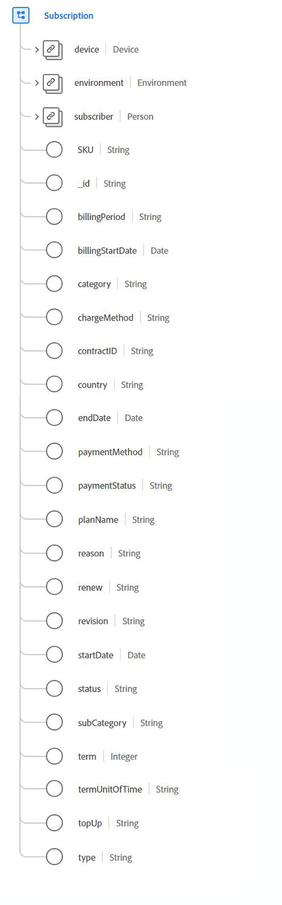

# Type de données [!UICONTROL Subscription]

[!UICONTROL Subscription] est un type de données XDM (modèle de données d’expérience) standard qui décrit les droits sous licence relatifs aux logiciels, services ou biens utilisés en fonction du temps ou de l’utilisation.

{width=500}

| Propriété | Type de données | Description |
| --- | --- | --- |
| `device` | [[!UICONTROL Device]](./device.md) | Décrit les détails sur l’appareil associé à l’abonnement. |
| `environment` | [[!UICONTROL Environment]](./environment.md) | Contient des informations sur la situation dans laquelle l’observation de l’événement s’est produite ; il s’agit notamment d’informations éphémères, telles que les versions logicielles ou réseau. |
| `subscriber` | [[!UICONTROL Person]](./person.md) | Décrit une personne. Elle peut également représenter une personne jouant différents rôles, tels que client, contact ou propriétaire. |
| `SKU` | Chaîne | Unité de gestion des stocks (SKU), identifiant unique d’un produit. |
| `billingPeriod` | Chaîne | Durée entre deux facturations. |
| `billingStartDate` | Date | Date d’exigibilité de la première facture. Le format de la date (sans l’heure) doit suivre la norme [RFC 3339, section 5.6](https://tools.ietf.org/html/rfc3339#section-5.6). |
| `category` | Chaîne | Catégorisation de niveau supérieur principale de ce type d’abonnement. |
| `chargeMethod` | Chaîne | Méthode de configuration de la facturation pour facturer les frais au client. |
| `contractID` | Chaîne | ID unique du contrat régissant cet abonnement. |
| `country` | Chaîne | Pays dans lequel les termes du contrat et de l’accord d’abonnement trouvent leur origine. |
| `endDate` | Date | Date à laquelle l’abonnement actuel se termine. Le format de la date (sans l’heure) doit suivre la norme [RFC 3339, section 5.6](https://tools.ietf.org/html/rfc3339#section-5.6). |
| `paymentMethod` | Chaîne | Mode de paiement des paiements récurrents. |
| `paymentStatus` | Chaîne | État de paiement du compte. |
| `planName` | Chaîne | Nom lisible par l’utilisateur de l’abonnement. |
| `reason` | Chaîne | Intention générale du membre quant à l’utilisation de l’abonnement. |
| `renew` | Chaîne | La manière dont l’abonnement peut continuer après la date de fin. |
| `revision` | Chaîne | Identification entre abonnements du même nom et de la même hiérarchie de catégories. |
| `startDate` | Date | Date du début de l’abonnement. Le format de la date (sans l’heure) doit suivre la norme [RFC 3339, section 5.6](https://tools.ietf.org/html/rfc3339#section-5.6). |
| `status` | Chaîne | Statut actuel de l’abonnement. |
| `subCategory` | Chaîne | Sous-catégorisation spécifique de l’abonnement. |
| `term` | Entier | Valeur numérique de la durée d’abonnement. |
| `termUnitOfTime` | Chaîne | Unité de temps pour la période du terme. |
| `topUp` | Chaîne | Décrit les conditions convenues selon lesquelles les aspects consommables d’un abonnement sont rachetés au cours d’une période de facturation. |
| `type` | Chaîne | La portée du droit par rapport au nombre de personnes couvertes par l’abonnement. |

{style="table-layout:auto"}

Pour plus d’informations sur ce type de données, reportez-vous au référentiel XDM public :

* [Exemple renseigné](https://github.com/adobe/xdm/blob/master/components/datatypes/industry-verticals/subscription.example.1.json)
* [Schéma complet](https://github.com/adobe/xdm/blob/master/components/datatypes/industry-verticals/subscription.schema.json)
