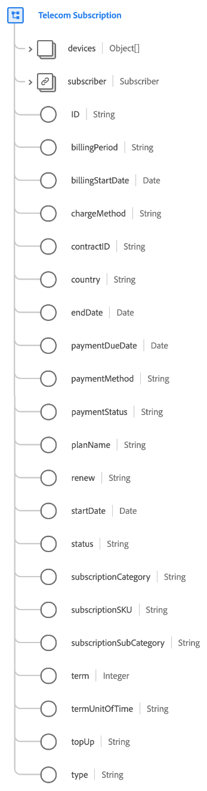
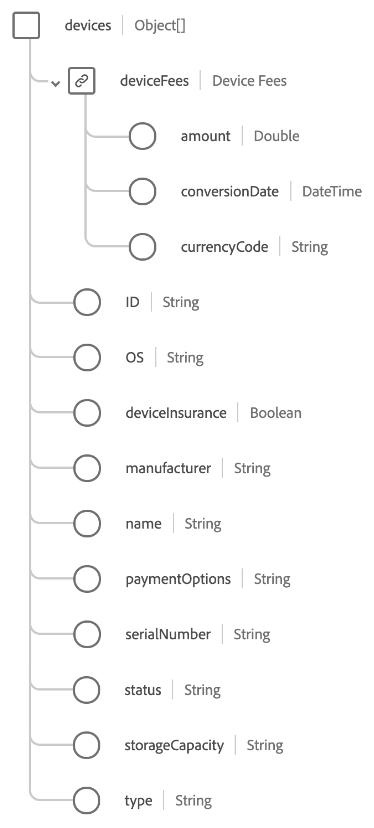

# Type de données [!UICONTROL Telecom Subscription]

[!UICONTROL Telecom Subscription] est un type de données standard du modèle de données d’expérience (XDM) qui décrit les détails pour des types d’abonnement de télécommunications spécifiques, tels qu’Internet, mobile, média ou fixe.

>[!NOTE]
>
>Ce document décrit le type de données. Pour le groupe de champs du même nom, reportez-vous au guide de référence du groupe de champs [[!UICONTROL Telecom Subscription] &#x200B;](../field-groups/profile/telecom-subscription.md).
>
>Si vous décrivez un type d’abonnement sans rapport avec le secteur des télécommunications, utilisez plutôt le type de données [[!UICONTROL Subscription] générique](./subscription.md).

| Propriété | Type de données | Description |
| --- | --- | --- |
| `devices` | Tableau d’objets | Décrit une liste d’appareils et/ou d’accessoires associés à la formule. Voir la [section ci-dessous](#devices) pour plus d’informations sur la structure attendue de chaque élément de tableau. |
| `subscriber` | [[!UICONTROL Person]](./person.md) | Décrit le propriétaire de l’abonnement. |
| `ID` | Chaîne | Identifiant unique de l’instance d’abonnement. |
| `billingPeriod` | Chaîne | Durée entre deux facturations. |
| `billingStartDate` | Date | Date de début de la période de facturation. Le format de la date (sans l’heure) doit suivre la norme [RFC 3339, section 5.6](https://tools.ietf.org/html/rfc3339#section-5.6). |
| `chargeMethod` | Chaîne | Méthode de configuration de la facturation pour facturer les frais au client. |
| `contractID` | Chaîne | ID unique du contrat régissant cet abonnement. |
| `country` | Chaîne | Pays dans lequel les termes du contrat et de l’accord d’abonnement trouvent leur origine. |
| `endDate` | Date | Date à laquelle l’abonnement actuel se termine. Le format de la date (sans l’heure) doit suivre la norme [RFC 3339, section 5.6](https://tools.ietf.org/html/rfc3339#section-5.6). |
| `paymentDueDate` | Date | Date d’échéance du paiement de l’abonnement. Le format de la date (sans l’heure) doit suivre la norme [RFC 3339, section 5.6](https://tools.ietf.org/html/rfc3339#section-5.6). |
| `paymentMethod` | Chaîne | Mode de paiement des paiements récurrents. |
| `paymentStatus` | Chaîne | État de paiement du compte. |
| `planName` | Chaîne | Nom lisible par l’utilisateur de l’abonnement. |
| `reason` | Chaîne | Intention générale du membre quant à l’utilisation de l’abonnement. |
| `renew` | Chaîne | La manière dont l’abonnement peut continuer après la date de fin. |
| `startDate` | Date | Date du début de l’abonnement. Le format de la date (sans l’heure) doit suivre la norme [RFC 3339, section 5.6](https://tools.ietf.org/html/rfc3339#section-5.6). |
| `status` | Chaîne | Statut actuel de l’abonnement. |
| `subscriptionCategory` | Chaîne | Catégorisation de niveau supérieur principale de ce type d’abonnement. |
| `subscriptionSKU` | Chaîne | Unité de stock (SKU) de l’abonnement. |
| `subscriptionSubCategory` | Chaîne | Sous-catégorisation spécifique de l’abonnement. |
| `term` | Entier | Valeur numérique de la durée d’abonnement. |
| `termUnitOfTime` | Chaîne | Unité de temps pour la période du terme. |
| `topUp` | Chaîne | Décrit les conditions convenues selon lesquelles les aspects consommables d’un abonnement sont rachetés au cours d’une période de facturation. |
| `type` | Chaîne | La portée du droit par rapport au nombre de personnes couvertes par l’abonnement. |

{style="table-layout:auto"}

Pour plus d’informations sur ce type de données, reportez-vous au référentiel XDM public :

* [Exemple renseigné](https://github.com/adobe/xdm/blob/master/components/datatypes/industry-verticals/subscription.example.1.json)
* [Schéma complet](https://github.com/adobe/xdm/blob/master/components/datatypes/industry-verticals/subscription.schema.json)

## `devices` {#devices}

`devices` est un tableau d’objets, où chaque objet décrit un appareil ou un accessoire associé à l’abonnement.

| Propriété | Type de données | Description |
| --- | --- | --- |
| `deviceFees` | Objet | Objet capturant les frais d’appareil pour des éléments tels que des routeurs, des modems et des récepteurs. Attend les propriétés suivantes :<ul><li>`amount` : Montant monétaire représenté par le `currencyCode`.</li><li>`conversionDate` : date à laquelle la conversion monétaire a été effectuée.</li><li>`currencyCode` : code de devise [ISO 4217](https://www.iso.org/iso-4217-currency-codes.html) pour le `amount`.</li></ul> |
| `ID` | Chaîne | Identifiant unique de l’appareil. |
| `OS` | Chaîne | Système d’exploitation de l’appareil. |
| `deviceInsurance` | Chaîne | Indique si un client a choisi de contracter une assurance pour cet appareil. |
| `manufacturer` | Chaîne | Fabricant de l’appareil. |
| `name` | Chaîne | Nom de l’appareil. |
| `paymentOptions` | Chaîne | Indique si l’appareil sera payé par mensualités ou au prix de détail complet. |
| `serialNumber` | Chaîne | Numéro de série de l’appareil. |
| `status` | Chaîne | Statut de l’appareil. |
| `storageCapacity` | Chaîne | Capacité de stockage du périphérique. |
| `type` | Chaîne | Type d’appareil. |

{style="table-layout:auto"}
