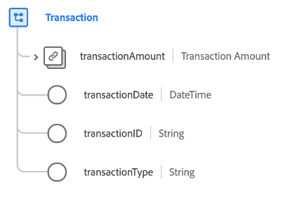

# Type de données [!UICONTROL Transaction]

[!UICONTROL Transaction] est un type de données standard du modèle de données d’expérience (XDM) qui décrit les détails d’une transaction monétaire.

| Propriété | Type de données | Description |
| --- | --- | --- |
| `transactionAmount` | [[!UICONTROL Currency]](./currency.md) | Décrit le montant de la devise échangée dans le cadre de la transaction. |
| `transactionDate` | [!UICONTROL DateTime] | Date et heure du moment où la transaction a eu lieu. |
| `transactionId` | [!UICONTROL String] | Identifiant unique de la transaction. |
| `transactionType` | [!UICONTROL String] | Type de transaction utilisé par le visiteur ou la visiteuse. |

{style="table-layout:auto"}
