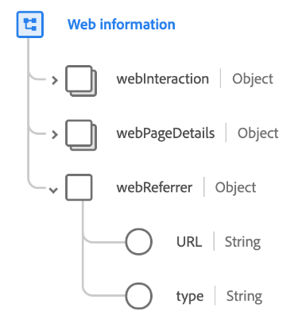

# Type de données [!UICONTROL Web information]

[!UICONTROL Web information] est un type de données standard du modèle de données d’expérience (XDM) qui décrit les informations enregistrées via un événement d’expérience spécifique au canal World Wide Web, y compris la page web, le référent et/ou le lien associé à l’interaction sur la page.

| Propriété | Type de données | Description |
| --- | --- | --- |
| `webInteraction` | [[!UICONTROL Web interaction]](./web-interaction.md) | Décrit les détails sur le lien web ou l’URL qui correspond à l’interaction. |
| `webPageDetails` | [[!UICONTROL Web page details]](./webpage-details.md) | Décrit les détails sur la page web où s’est produite l’interaction web. |
| `webReferrer` | [!UICONTROL Object] | Décrit le référent d’une interaction web, qui est l’URL de provenance du visiteur juste avant l’enregistrement de l’interaction web actuelle. Contient les sous-propriétés suivantes : <ul><li>`URL` : URL du référent.</li><li>`type` : type de référent.</li></ul> |

{style="table-layout:auto"}

Pour plus d’informations sur ce type de données, reportez-vous au référentiel XDM public :

* [Exemple renseigné](https://github.com/adobe/xdm/blob/master/components/datatypes/webinfo.example.1.json)
* [Schéma complet](https://github.com/adobe/xdm/blob/master/components/datatypes/webinfo.schema.json)
