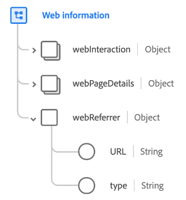

# Type de données [!UICONTROL Web information]

[!UICONTROL Informations web] est un type de données XDM (Experience Data Model) standard qui décrit les informations enregistrées via un événement d’expérience spécifique au canal World Wide Web, y compris la page web, le référent et/ou le lien associé à l’interaction sur la page.

| Propriété | Type de données | Description |
| --- | --- | --- |
| `webInteraction` | [[!UICONTROL Interaction web]](./web-interaction.md) | Décrit les détails du lien web ou de l’URL qui correspond à l’interaction. |
| `webPageDetails` | [[!UICONTROL Détails de la page web]](./webpage-details.md) | Décrit les détails de la page web sur laquelle l’interaction web s’est produite. |
| `webReferrer` | [!UICONTROL Objet] | Décrit le référent d’une interaction web, c’est-à-dire l’URL d’origine d’un visiteur juste avant l’enregistrement de l’interaction web actuelle. Contient les sous-propriétés suivantes : <ul><li>`URL` : URL du référent.</li><li>`type` : type de référent.</li></ul> |

{style="table-layout:auto"}

Pour plus d’informations sur le type de données, reportez-vous au référentiel XDM public :

* [Exemple renseigné](https://github.com/adobe/xdm/blob/master/components/datatypes/webinfo.example.1.json)
* [Schéma complet](https://github.com/adobe/xdm/blob/master/components/datatypes/webinfo.schema.json)
