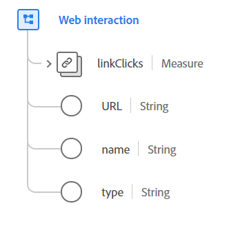

# Type de données [!UICONTROL Web interaction]

[!UICONTROL Web interaction] est un type de données standard du modèle de données d’expérience (XDM) qui décrit les informations sur les interactions qui se sont produites sur une page web une fois le chargement initial de la page terminé. Il est destiné à enregistrer les interactions dans des applications web riches qui ne déclenchent pas de nouveau chargement de page, telles que les applications web monopages (SPA).

{width=500}

| Propriété | Type de données | Description |
| --- | --- | --- |
| `linkClicks` | [[!UICONTROL Measure]](./measure.md) | Mesure assurant le suivi des clics sur un lien web. |
| `URL` | Chaîne | URL ou lien réel utilisé pour cette interaction web. |
| `name` | Chaîne | Nom normatif utilisé pour ce lien web. Il est utilisé à des fins de classification. |
| `type` | Chaîne | Type de lien. Cette propriété doit être égale à l’une des valeurs d’énumération suivantes : <li> `download` </li> <li> `exit` </li> <li> `other` </li> |

{style="table-layout:auto"}

Pour plus d’informations sur ce type de données, reportez-vous au référentiel XDM public :

* [Exemple renseigné](https://github.com/adobe/xdm/blob/master/components/datatypes/deprecated/webinteraction.example.1.json)
* [Schéma complet](https://github.com/adobe/xdm/blob/master/components/datatypes/deprecated/webinteraction.schema.json)
