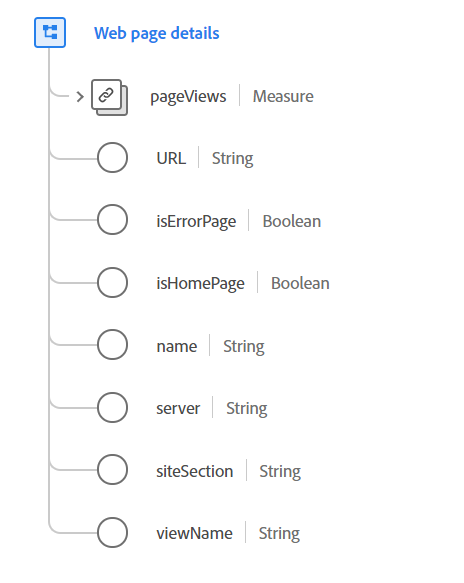

# Type de données [!UICONTROL Web page details]

[!UICONTROL Web page details] est un type de données standard du modèle de données d’expérience (XDM) qui décrit en détail une page web qui vient d’être chargée et consultée, telle qu’enregistrée par un ExperienceEvent.

Le type de données est destiné aux détails complets de la page et aux chargements initiaux de page des applications web monopages (SPA). Pour les interactions qui se produisent sur une page chargée et qui ne déclenchent pas de nouveau chargement de page, reportez-vous à la section Type de données [interaction web](./web-interaction.md).

{width="500"}

| Propriété | Type de données | Description |
| --- | --- | --- |
| `pageViews` | [[!UICONTROL Measure]](./measure.md) | Nombre de vues sur une page web. |
| `URL` | Chaîne | URL normative ou habituelle de la page web. Il peut s’agir ou non de l’URL réelle utilisée pour accéder à la page. Pour enregistrer l’URL utilisée pour accéder à la page, utilisez `webLink`. Le format URI doit respecter la norme [RFC 3986](https://tools.ietf.org/html/rfc3986). |
| `isErrorPage` | Booléen | Cette propriété utilise un indicateur pour indiquer si la page est une page d’erreur ou non. Cet indicateur est utilisé pour classer les interactions web de manière générale. L’erreur est définie par l’application et peut correspondre à une page diffusée avec un code d’erreur HTTP. |
| `isHomePage` | Booléen | Cette propriété utilise un indicateur pour indiquer si la page est une page d’accueil ou non. Cet indicateur est utilisé pour classer les interactions web de manière générale. La définition de la page d’accueil est déterminée par l’application. |
| `name` | Chaîne | Nom normatif de la page web. Ce nom ne correspond pas nécessairement au titre de la page et n’est pas directement associé au contenu de la page. Il est utilisé pour organiser les pages d’un site à des fins de classification. |
| `server` | Chaîne | Serveur habituel ou normatif qui héberge la page web. Il peut s’agir ou non de l’hôte ou du serveur qui a diffusé l’interaction de page. |
| `siteSection` | Chaîne | Nom normatif de la section de site où réside cette page web. Vous pouvez l’utiliser pour classer ou catégoriser l’interaction. |
| `viewName` | Chaîne | Nom de la vue, dans une page. Cette propriété est généralement utilisée avec les applications monopages ou les pages qui comportent des onglets ou des contrôles qui modifient une grande partie de la mise en page. |

{style="table-layout:auto"}

Pour plus d’informations sur ce type de données, reportez-vous au référentiel XDM public :

* [Exemple renseigné](https://github.com/adobe/xdm/blob/master/components/datatypes/deprecated/webpagedetails.example.2.json)
* [Schéma complet](https://github.com/adobe/xdm/blob/master/components/datatypes/deprecated/webpagedetails.schema.json)
