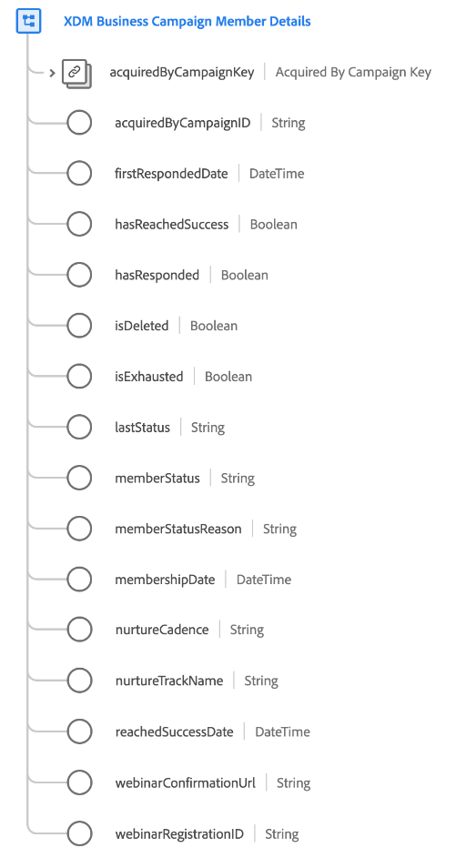

# [!UICONTROL Détails du membre XDM Business Campaign] du groupe de champs de schéma

[!UICONTROL XDM Business Campaign Member Details] est un groupe de champs de schéma standard pour la [[!UICONTROL classe XDM Business Campaign Members]](../../classes/b2b/business-campaign-members.md), qui capture des informations détaillées sur une campagne d’entreprise.

| Propriété | Type de données | Description |
| --- | --- | --- |
| `acquiredByCampaignKey` | [[!UICONTROL Source B2B]](../../data-types/b2b-source.md) | L’identifiant composite de la campagne qui a acquis ce membre de campagne. |
| `acquiredByCampaignID` | [!UICONTROL Chaîne] | Identifiant de chaîne pour la campagne qui a acquis ce membre de campagne. |
| `firstRespondedDate` | [!UICONTROL DateTime] | Date et heure ISO 8601 de la première réponse de la personne à la campagne. |
| `hasReachedSuccess` | [!UICONTROL Booléen] | Indique si ce membre de campagne a généré une conversion réussie. |
| `hasResponded` | [!UICONTROL Booléen] | Indique si ce membre de campagne a répondu à la campagne. |
| `isDeleted` | [!UICONTROL Booléen] | Indique si ce membre de campagne a été supprimé dans Marketo Engage.  Lors de l’utilisation du [connecteur source Marketo](../../../sources/connectors/adobe-applications/marketo/marketo.md), tous les enregistrements supprimés dans Marketo sont automatiquement répercutés dans Real-time Customer Profile. Cependant, les enregistrements relatifs à ces profils peuvent toujours persister dans le lac de données. En définissant `isDeleted` sur `true`, vous pouvez utiliser le champ pour filtrer les enregistrements qui ont été supprimés de vos sources lors de l’interrogation du lac de données. |
| `isExhausted` | [!UICONTROL Booléen] | Indique si ce membre de campagne a épuisé toutes les interactions de campagne. |
| `lastStatus` | [!UICONTROL Chaîne] | Dernier état du membre de la campagne. |
| `memberStatus` | [!UICONTROL Chaîne] | État actuel du membre de la campagne. |
| `memberStatusReason` | [!UICONTROL Chaîne] | Raison de l’état actuel du membre de la campagne. |
| `membershipDate` | [!UICONTROL DateTime] | Raison de l’état actuel du membre de la campagne. |
| `nurtureCadence` | [!UICONTROL Chaîne] | Date et heure auxquelles les informations relatives à la campagne doivent être présentées au membre de la campagne. |
| `nurtureTrackName` | [!UICONTROL Chaîne] | Nom du programme d’éducation auquel ce membre de campagne est soumis. |
| `reachedSuccessDate` | [!UICONTROL DateTime] | Horodatage ISO 8601 pour le moment où une conversion réussie a été effectuée pour le membre de la campagne. |
| `webinarConfirmationUrl` | [!UICONTROL Chaîne] | URL de confirmation du webinaire du membre de la campagne. |
| `webinarRegistrationID` | [!UICONTROL Chaîne] | ID d’enregistrement du webinaire du membre de la campagne. |

{style="table-layout:auto"}

Pour plus d’informations sur le groupe de champs, reportez-vous au référentiel XDM public :

* [Exemple renseigné](https://github.com/adobe/xdm/blob/master/components/fieldgroups/campaign-member/campaign-member-details.example.1.json)
* [Schéma complet](https://github.com/adobe/xdm/blob/master/components/fieldgroups/campaign-member/campaign-member-details.schema.json)
