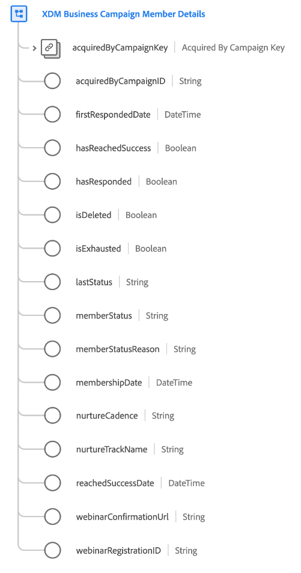

# [!UICONTROL Détails des membres de XDM Business Campaign] groupe de champs de schéma

[!UICONTROL Détails des membres de XDM Business Campaign] est un groupe de champs de schéma standard pour la classe [[!UICONTROL Membres de XDM Business Campaign]](../../classes/b2b/business-campaign-members.md), qui capture des informations détaillées sur une campagne commerciale.

| Propriété | Type de données | Description |
| --- | --- | --- |
| `acquiredByCampaignKey` | Source B2B[&#128279;](../../data-types/b2b-source.md) | Identifiant composite de la campagne qui a acquis ce membre de campagne. |
| `acquiredByCampaignID` | [!UICONTROL Chaîne] | Identifiant de chaîne de la campagne qui a acquis ce membre de campagne. |
| `firstRespondedDate` | [!UICONTROL DateHeure] | Horodatage [ISO 8601](https://datatracker.ietf.org/doc/html/rfc3339#section-5.6) (`yyyy-MM-dd'T'HH:mm:ssXXX`) du moment où la personne a répondu pour la première fois à la campagne. |
| `hasReachedSuccess` | [!UICONTROL booléen] | Indique si ce membre de la campagne a abouti à une conversion. |
| `hasResponded` | [!UICONTROL booléen] | Indique si ce membre de la campagne a répondu à la campagne. |
| `isDeleted` | [!UICONTROL booléen] | Indique si ce membre de la campagne a été supprimé dans Marketo Engage.  Lors de l’utilisation du connecteur source [Marketo](../../../sources/connectors/adobe-applications/marketo/marketo.md), tous les enregistrements supprimés dans Marketo sont automatiquement répercutés dans le profil client en temps réel. Cependant, les enregistrements relatifs à ces profils peuvent toujours persister dans le lac de données. En définissant `isDeleted` sur `true`, vous pouvez utiliser le champ pour filtrer les enregistrements qui ont été supprimés de vos sources lors de l’interrogation du lac de données. |
| `isExhausted` | [!UICONTROL booléen] | Indique si ce membre de campagne a épuisé toutes les interactions de campagne. |
| `lastStatus` | [!UICONTROL Chaîne] | Dernier statut du membre de la campagne. |
| `memberStatus` | [!UICONTROL Chaîne] | Statut actuel du membre de la campagne. |
| `memberStatusReason` | [!UICONTROL Chaîne] | Raison du statut actuel du membre de la campagne. |
| `membershipDate` | [!UICONTROL DateHeure] | Raison du statut actuel du membre de la campagne. |
| `nurtureCadence` | [!UICONTROL Chaîne] | Cadence temporelle selon laquelle les informations relatives à la campagne doivent être présentées au membre de la campagne. |
| `nurtureTrackName` | [!UICONTROL Chaîne] | Nom du programme d’éducation auquel ce membre de la campagne est soumis. |
| `reachedSuccessDate` | [!UICONTROL DateHeure] | Horodatage ISO 8601 (`yyyy-MM-dd'T'HH:mm:ssXXX`) indiquant le moment où une conversion réussie a été effectuée pour le membre de la campagne. |
| `webinarConfirmationUrl` | [!UICONTROL Chaîne] | URL de confirmation du webinaire pour le membre de la campagne. |
| `webinarRegistrationID` | [!UICONTROL Chaîne] | ID d’enregistrement du webinaire pour le membre de la campagne. |

{style="table-layout:auto"}

Pour plus d’informations sur le groupe de champs , consultez le référentiel XDM public :

* [Exemple renseigné](https://github.com/adobe/xdm/blob/master/components/fieldgroups/campaign-member/campaign-member-details.example.1.json)
* [Schéma complet](https://github.com/adobe/xdm/blob/master/components/fieldgroups/campaign-member/campaign-member-details.schema.json)
