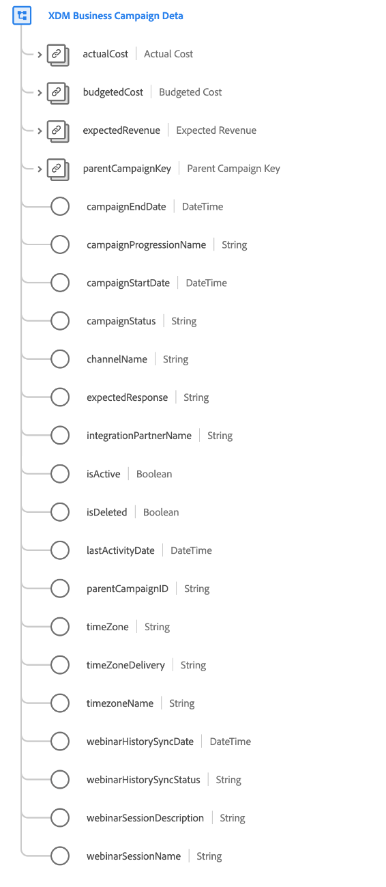

# [!UICONTROL Détails XDM Business Campaign] groupe de champs de schéma

[!UICONTROL Détails de XDM Business Campaign] est un groupe de champs de schéma standard pour la classe [[!UICONTROL XDM Business Campaign]](../../classes/b2b/business-campaign.md), qui recueille les informations détaillées sur une campagne commerciale.

| Propriété | Type de données | Description |
| --- | --- | --- |
| `actualCost` | [[!UICONTROL Devise]](../../data-types/currency.md) | Représente le coût réel de la campagne commerciale. |
| `budgetedCost` | [[!UICONTROL Devise]](../../data-types/currency.md) | Représente le coût budgété de la campagne commerciale. |
| `expectedRevenue` | [[!UICONTROL Devise]](../../data-types/currency.md) | Représente le chiffre d’affaires que la campagne commerciale est censée générer. |
| `parentCampaignKey` | Source B2B[&#128279;](../../data-types/b2b-source.md) | Identifiant composite d’une campagne parent, le cas échéant. |
| `campaignEndDate` | [!UICONTROL DateHeure] | Horodatage [ISO 8601](https://datatracker.ietf.org/doc/html/rfc3339#section-5.6) (`yyyy-MM-dd'T'HH:mm:ssXXX`) du moment où la campagne s’est terminée ou se terminera. |
| `campaignProgressionName` | [!UICONTROL Chaîne] | Nom de la progression de la campagne. |
| `campaignStartDate` | [!UICONTROL DateHeure] | Horodatage ISO 8601 (`yyyy-MM-dd'T'HH:mm:ssXXX`) du moment où la campagne a démarré ou démarrera. |
| `campaignStatus` | [!UICONTROL Chaîne] | Statut actuel de la campagne. |
| `channelName` | [!UICONTROL Chaîne] | Nom du canal associé à cette campagne. |
| `expectedResponse` | [!UICONTROL Chaîne] | Réponse attendue pour la campagne. |
| `integrationPartnerName` | [!UICONTROL Chaîne] | Nom du partenaire qui a été intégré à cette campagne. |
| `isActive` | [!UICONTROL booléen] | Indique si cette campagne est active. |
| `isDeleted` | [!UICONTROL booléen] | Indique si cette campagne a été supprimée dans Marketo Engage.  Lors de l’utilisation du connecteur source [Marketo](../../../sources/connectors/adobe-applications/marketo/marketo.md), tous les enregistrements supprimés dans Marketo sont automatiquement répercutés dans le profil client en temps réel. Cependant, les enregistrements relatifs à ces profils peuvent toujours persister dans le lac de données. En définissant `isDeleted` sur `true`, vous pouvez utiliser le champ pour filtrer les enregistrements qui ont été supprimés de vos sources lors de l’interrogation du lac de données. |
| `lastActivityDate` | [!UICONTROL DateHeure] | Horodatage ISO 8601 (`yyyy-MM-dd'T'HH:mm:ssXXX`) de la dernière activité associée à la campagne. |
| `timeZone` | [!UICONTROL Chaîne] | Fuseau horaire dans lequel opère la campagne. |
| `timeZoneDelivery` | [!UICONTROL Chaîne] | Fuseau horaire de diffusion dans lequel opère la campagne. |
| `timeZoneName` | [!UICONTROL Chaîne] | Nom du fuseau horaire dans lequel la campagne opère. |
| `webinarHistorySyncDate` | [!UICONTROL DateHeure] | Horodatage ISO 8601 (`yyyy-MM-dd'T'HH:mm:ssXXX`) de la dernière synchronisation de l’historique du webinaire pour cette campagne. |
| `webinarHistorySyncStatus` | [!UICONTROL Chaîne] | Statut de la synchronisation de l’historique du webinaire pour cette campagne. |
| `webinarSessionDescription` | [!UICONTROL Chaîne] | Description de la session de webinaire associée à cette campagne. |
| `webinarSessionName` | [!UICONTROL Chaîne] | Nom de la session de webinaire associée à cette campagne. |

{style="table-layout:auto"}

Pour plus d’informations sur le groupe de champs , consultez le [référentiel XDM public](https://github.com/adobe/xdm/blob/master/components/fieldgroups/campaign/campaign-details.schema.json).
