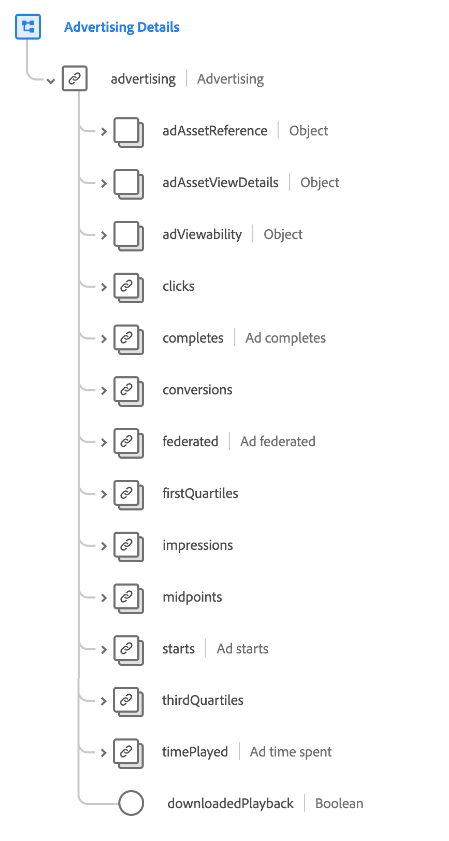
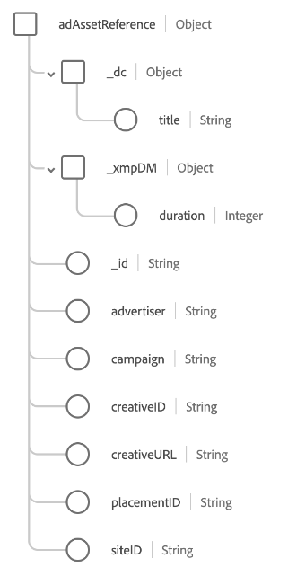
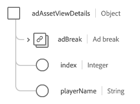
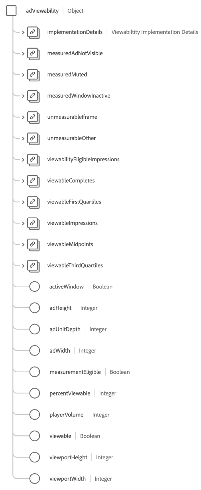

# Groupe de champs de schéma [!UICONTROL Détails Advertising ]

[!UICONTROL Détails ] est un groupe de champs de schéma standard pour la [[!DNL XDM ExperienceEvent] classe](../../classes/experienceevent.md). Le groupe de champs fournit un seul objet `advertising` à un schéma, qui recueille les informations relatives aux impressions, aux clics et à l’attribution de la publicité.

| Propriété | Type de données | Description |
| --- | --- | --- |
| `adAssetReference` | Objet | Capture les informations sur la ressource relatives à la publicité. Pour plus d’informations sur la structure de cet objet](#adAssetReference) consultez la [sous-section ci-dessous. |
| `adAssetViewDetails` | Objet | Capture les détails d’affichage de la lecture de l’annonce publicitaire. Pour plus d’informations sur la structure de cet objet](#adAssetViewDetails) consultez la [sous-section ci-dessous. |
| `adViewability` | Objet | Capture le nombre d’impressions vues par les utilisateurs finaux, comme le volume du lecteur, la version de la bibliothèque, le statut de la fenêtre et les dimensions de fenêtre d’affichage des publicités. Pour plus d’informations sur la structure de cet objet](#adViewability) consultez la [sous-section ci-dessous. |
| `clicks` | [[!UICONTROL Mesure]](../../data-types/measure.md) | Nombre d’actions de clic sur la publicité. |
| `completes` | [[!UICONTROL Mesure]](../../data-types/measure.md) | Nombre de fois qu’une ressource de média horodatée a été visionnée jusqu’à la fin. Cela ne signifie pas nécessairement que l’utilisateur final a visionné l’intégralité de la vidéo, car il a peut-être sauté certaines parties. |
| `conversions` | [[!UICONTROL Mesure]](../../data-types/measure.md) | Nombre de fois qu’une ou plusieurs actions prédéfinies ont déclenché un événement pour l’évaluation des performances. |
| `federated` | [[!UICONTROL Mesure]](../../data-types/measure.md) | Indique si un événement d’expérience a été créé via une fédération de données, comme un partage de données entre des clients. |
| `firstQuartiles` | [[!UICONTROL Mesure]](../../data-types/measure.md) | Nombre de fois qu’une publicité vidéo numérique a été lue pendant 25 % de sa durée à vitesse normale. |
| `impressions` | [[!UICONTROL Mesure]](../../data-types/measure.md) | Nombre d’impressions d’annonce publicitaire envoyées à un utilisateur final avec la possibilité d’être vues. |
| `midpoints` | [[!UICONTROL Mesure]](../../data-types/measure.md) | Nombre de fois qu’une publicité vidéo numérique a été lue pendant 50 % de sa durée à vitesse normale. |
| `starts` | [[!UICONTROL Mesure]](../../data-types/measure.md) | Nombre de fois qu’une publicité vidéo numérique a commencé à être lue. |
| `thirdQuartiles` | [[!UICONTROL Mesure]](../../data-types/measure.md) | Nombre de fois qu’une publicité vidéo numérique a été lue pendant 75 % de sa durée à vitesse normale. |
| `timePlayed` | [[!UICONTROL Mesure]](../../data-types/measure.md) | Temps passé par un utilisateur final sur une ressource de média horodatée spécifique. |
| `downloadedPlayback` | Booléen | Lorsque la valeur est définie sur `true`, indique que l’accès est généré en raison de la lecture d’une session publicitaire téléchargée. |

{style="table-layout:auto"}

## `adAssetReference` {#adAssetReference}

L’objet `adAssetReference` capture les informations de ressource sur la publicité.

| Propriété | Type de données | Description |
| --- | --- | --- |
| `_dc.title` | Chaîne | Nom convivial et lisible par l’utilisateur de la ressource publicitaire. |
| `_xmpDM.duration` | Entier | Longueur ou durée de la ressource en secondes. |
| `_id` | Chaîne | Identifiant unique de la ressource publicitaire, conforme à la norme [Ad-ID](https://datatracker.ietf.org/doc/html/rfc8107). |
| `advertiser` | Chaîne | Société ou marque dont le produit apparaît dans la publicité. |
| `campaign` | Chaîne | Identifiant de la campagne publicitaire. |
| `creativeID` | Chaîne | Identifiant du contenu publicitaire. |
| `creativeURL` | Chaîne | URL de la création publicitaire. |
| `placementID` | Chaîne | Identifiant d’emplacement de la publicité. |
| `siteID` | Chaîne | Identifiant du site publicitaire. |

{style="table-layout:auto"}

## `adAssetViewDetails` {#adAssetViewDetails}

L’objet `adAssetViewDetails` capture les détails d’affichage de la lecture de l’annonce publicitaire.

| Propriété | Type de données | Description |
| --- | --- | --- |
| `adBreak` | [[!UICONTROL Coupure publicitaire]](../../data-types/ad-break.md) | Décrit comment une publicité horodatée est insérée dans un média horodaté. |
| `index` | Entier | Index de l’annonce publicitaire dans la coupure publicitaire parent. Par exemple, la première publicité a un index `0` et la seconde un index `1`. |
| `playerName` | Chaîne | Nom du lecteur responsable du rendu de la publicité. |

{style="table-layout:auto"}

## `adViewability` {#adViewability}

L’objet `adViewability` capture le nombre d’impressions affichées par les utilisateurs finaux, comme le volume du lecteur, la version de la bibliothèque, le statut de la fenêtre et les dimensions de la fenêtre d’affichage des publicités.

| Propriété | Type de données | Description |
| --- | --- | --- |
| `implementationDetails` | [[!UICONTROL Détails d’implémentation]](../../data-types/implementation-details.md) | Nom et version de la bibliothèque instrumentée pour évaluer les mesures de visibilité. |
| `measuredAdNotVisible` | [[!UICONTROL Mesure]](../../data-types/measure.md) | Indique que la publicité n’est pas visible telle que mesurée par une bibliothèque de visibilité au moment de l’impression. |
| `measuredMuted` | [[!UICONTROL Mesure]](../../data-types/measure.md) | Indique que l’annonce publicitaire est en mode silencieux, comme le mesure une bibliothèque de visibilité au moment de l’impression. |
| `unmeasurableIframe` | [[!UICONTROL Mesure]](../../data-types/measure.md) | Indique que la publicité s’affiche dans une fenêtre inactive telle qu’elle est mesurée par une bibliothèque de visibilité au moment de l’impression. |
| `unmeasurableOther` | [[!UICONTROL Mesure]](../../data-types/measure.md) | Indique que la bibliothèque de visibilité ne peut pas exécuter correctement les mesures en raison de l’affichage de la publicité dans un iframe. |
| `viewabilityEligibleImpressions` | [[!UICONTROL Mesure]](../../data-types/measure.md) | Impression(s) d’une publicité pour un utilisateur final avec bibliothèque de visibilité exécutée. |
| `viewabilityCompletes` | [[!UICONTROL Mesure]](../../data-types/measure.md) | Lecture(s) complète(s) d’une publicité présentée à un utilisateur final et considérée comme visible à la fin de l’opération par une bibliothèque de visibilité. |
| `viewableFirstQuartiles` | [[!UICONTROL Mesure]](../../data-types/measure.md) | Premier quartile d’une publicité présentée à un utilisateur final et considérée comme visible au premier quartile de la lecture par une bibliothèque de visibilité. |
| `viewableImpressions` | [[!UICONTROL Mesure]](../../data-types/measure.md) | Impressions d’une publicité présentée à un utilisateur final et considérée comme visible après deux secondes de lecture par une bibliothèque de visibilité. |
| `viewableMidpoints` | [[!UICONTROL Mesure]](../../data-types/measure.md) | Milieu d’une publicité présentée à un utilisateur final et considérée comme visible au milieu de la lecture par une bibliothèque de visibilité. |
| `viewableThirdQuartiles` | [[!UICONTROL Mesure]](../../data-types/measure.md) | Troisième quartile d’une publicité présentée à un utilisateur final et considérée comme visible au troisième quartile de la lecture par une bibliothèque de visibilité. |
| `activeWindow` | Booléen | Indique si l’annonce publicitaire a été affichée dans la fenêtre active de l’appareil de l’utilisateur. |
| `adHeight` | Entier | Nombre de pixels verticaux du lecteur, mesuré au moment de l’exécution. Cette taille peut être supérieure à la taille de la publicité si le lecteur dispose de commandes ou de miniatures en supplément. |
| `adUnitDepth` | Entier | Les éditeurs peuvent incorporer des annonces publicitaires dans des conteneurs (iFrames) afin de limiter l’accès au seul code de la page. Cette valeur décrit le nombre de conteneurs dans lesquels l’entité publicitaire est affichée. |
| `adWidth` | Entier | Nombre de pixels horizontaux du lecteur, mesuré au moment de l’exécution. Cette taille peut être supérieure à la taille de la publicité si le lecteur dispose de commandes ou de miniatures en supplément. |
| `measurementEligible` | Booléen | Précise si la publicité était éligible à la mesure de la visibilité. Une publicité est éligible si le format de création et le type de balise de l’unité sont pris en charge. |
| `percentViewable` | Entier | Pourcentage de pixels dans l’annonce publicitaire considérés comme visibles au moment de la mesure. |
| `playerVolume` | Entier | Pourcentage de volume du lecteur mesuré au moment de l’exécution, où `0` est muet et `100` est le volume maximal. |
| `viewable` | Booléen | Indique si la publicité était visible au moment de l’exécution. Les publicités display sont considérées comme visibles lorsqu’au moins 50 % de la publicité est visible pendant au moins une seconde. Les publicités vidéo sont considérées comme visibles lorsqu’au moins 50 % de la publicité est visible pendant que la vidéo est lue pendant au moins deux secondes consécutives. |
| `viewportHeight` | Entier | Taille verticale (en pixels) de la fenêtre dans laquelle l’expérience a été affichée, mesurée au moment de l’exécution. Pour un événement d’affichage web, cette valeur indique la hauteur de la fenêtre d’affichage du navigateur. |
| `viewportWidth` | Entier | Taille horizontale (en pixels) de la fenêtre dans laquelle l’expérience a été affichée, mesurée au moment de l’exécution. Pour un événement d’affichage web, cette valeur indique la largeur de la fenêtre d’affichage du navigateur. |

{style="table-layout:auto"}

Pour plus d’informations sur le groupe de champs , consultez le [référentiel XDM public](https://github.com/adobe/xdm/blob/master/components/fieldgroups/experience-event/experienceevent-advertising.schema.json).
