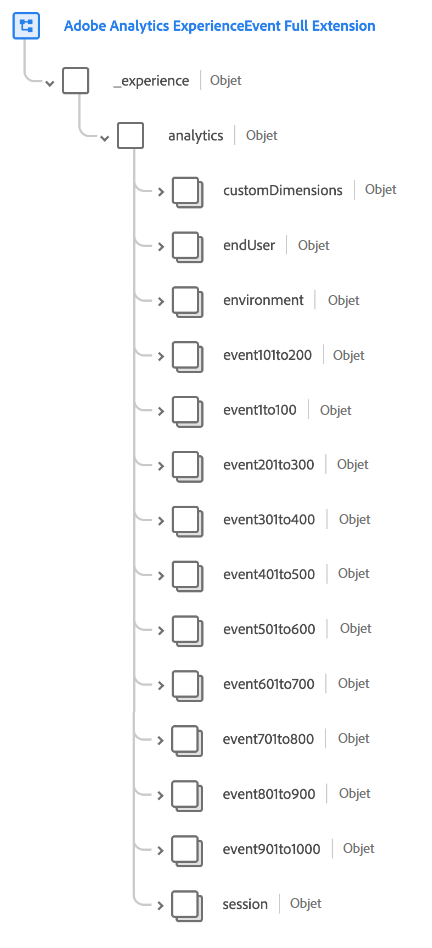
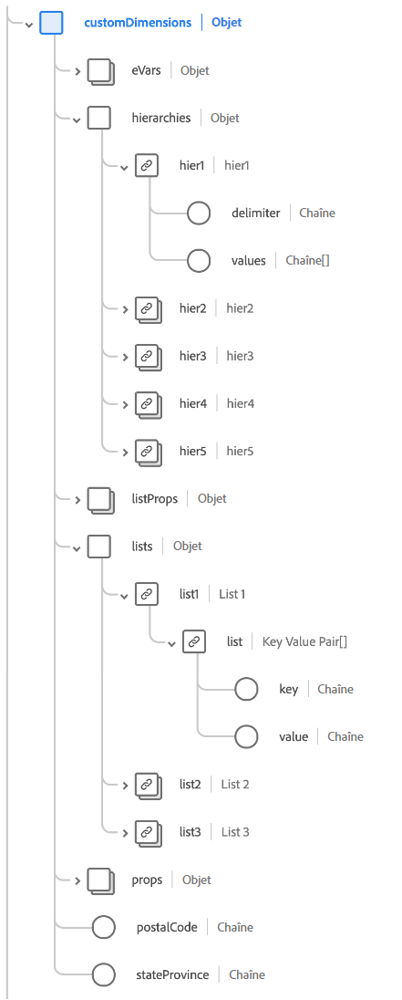
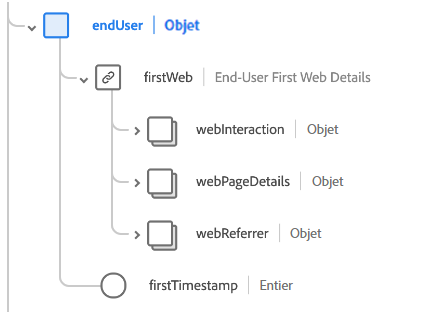
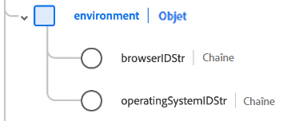
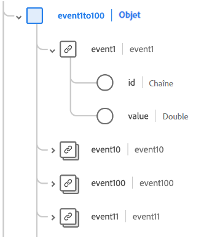
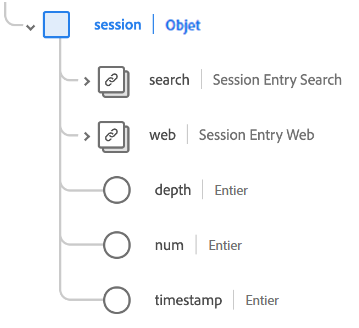

# Groupe de champs de schéma d’[!UICONTROL extension complète Adobe Analytics ExperienceEvent]

[!UICONTROL Extension complète Adobe Analytics ExperienceEvent] est un groupe de champs de schéma standard pour la [[!DNL XDM ExperienceEvent] classe](../../classes/experienceevent.md), qui capture les mesures courantes collectées par Adobe Analytics.

Ce document décrit la structure et le cas d’utilisation du groupe de champs de l’extension Analytics.

>[!NOTE]
>
>En raison de la taille et du nombre d’éléments répétés dans ce groupe de champs, de nombreux champs présentés dans ce guide ont été réduits pour gagner de l’espace. Pour explorer la structure complète de ce groupe de champs, vous pouvez [le rechercher dans l’interface utilisateur de Platform](../../ui/explore.md) ou afficher le schéma complet dans le [référentiel XDM public](https://github.com/adobe/xdm/blob/master/extensions/adobe/experience/analytics/experienceevent-all.schema.json).

## Structure du groupe de champs

Le groupe de champs fournit un seul objet `_experience` à un schéma, qui contient lui-même un seul objet `analytics`.

| Propriété | Type de données | Description |
| --- | --- | --- |
| `customDimensions` | Objet | Capture les dimensions personnalisées trackées par Analytics. Pour plus d’informations sur le contenu de cet objet, consultez la [sous-section ci-dessous](#custom-dimensions). |
| `endUser` | Objet | Capture les détails de l’interaction web pour l’utilisateur final qui a déclenché l’événement. Pour plus d’informations sur le contenu de cet objet, consultez la [sous-section ci-dessous](#end-user). |
| `environment` | Objet | Capture les informations sur le navigateur et le système d’exploitation qui ont déclenché l’événement. Pour plus d’informations sur le contenu de cet objet, consultez [la sous-section ci-dessous](#environment). |
| `event1to100`  `event101to200`  `event201to300`  `event301to400`  `event401to500`  `event501to100`  `event601to700`  `event701to800`  `event801to900`  `event901to1000` | Objet | Le groupe de champs fournit des champs d’objet pour capturer jusqu’à 1 000 événements personnalisés. Pour plus d’informations sur ces champs, consultez la [sous-section ci-dessous](#events). |
| `session` | Objet | Capture des informations sur la session qui a déclenché l’événement. Pour plus d’informations sur le contenu de cet objet, consultez la [sous-section ci-dessous](#session). |

{style="table-layout:auto"}

## `customDimensions` {#custom-dimensions}

`customDimensions` capture les [dimensions](https://experienceleague.adobe.com/docs/analytics/components/dimensions/overview.html?lang=fr) personnalisées qui sont trackées par Analytics.

| Propriété | Type de données | Description |
| --- | --- | --- |
| `eVars` | Objet | Objet qui capture jusqu’à 250 variables de conversion ([eVars](https://experienceleague.adobe.com/docs/analytics/components/dimensions/evar.html?lang=fr)). Les propriétés de cet objet sont indexées de `eVar1` à `eVar250` et n’acceptent que des chaînes comme type de données. |
| `hierarchies` | Objet | Objet qui capture jusqu’à cinq variables hiérarchiques personnalisées ([hiers](https://experienceleague.adobe.com/docs/analytics/implementation/vars/page-vars/hier.html?lang=fr)). Les propriétés de cet objet sont indexées de `hier1` à `hier5`, qui sont elles-mêmes des objets avec les sous-propriétés suivantes :<ul><li>`delimiter` : délimiteur original utilisé pour générer la liste fournie sous `values`.</li><li>`values` : liste délimitée de noms de niveau de hiérarchie, représentés sous forme de chaîne.</li></ul> |
| `listProps` | Objet | Objet capturant jusqu’à 75 [props de liste](https://experienceleague.adobe.com/docs/analytics/implementation/vars/page-vars/prop.html?lang=fr#props-de-liste). Les propriétés de cet objet sont indexées de `prop1` à `prop75`, qui sont elles-mêmes des objets avec les sous-propriétés suivantes :<ul><li>`delimiter` : délimiteur d’origine utilisé pour générer la liste fournie sous `values`.</li><li>`values` : liste délimitée de valeurs pour la variable prop, représentée sous la forme d’une chaîne.</li></ul> |
| `lists` | Objet | Objet capturant jusqu’à trois [listes](https://experienceleague.adobe.com/docs/analytics/implementation/vars/page-vars/list.html?lang=fr). Les propriétés de cet objet sont indexées de `list1` à `list3`. Chacune de ces propriétés contient un seul tableau `list` de types de données [[!UICONTROL Paire clé-valeur]](../../data-types/key-value-pair.md). |
| `props` | Objet | Objet capturant jusqu’à 75 [props](https://experienceleague.adobe.com/docs/analytics/implementation/vars/page-vars/prop.html?lang=fr). Les propriétés de cet objet sont indexées de `prop1` à `prop75` et n’acceptent que les chaînes pour leur type de données. |
| `postalCode` | Chaîne | Code postal fourni par le client. |
| `stateProvince` | Chaîne | Emplacement de province ou d’État fourni par le client. |

{style="table-layout:auto"}

## `endUser` {#end-user}

`endUser` capture les détails de l’interaction web pour l’utilisateur final qui a déclenché l’événement.

| Propriété | Type de données | Description |
| --- | --- | --- |
| `firstWeb` | [[!UICONTROL Informations web]](../../data-types/web-information.md) | Informations relatives à la page, au lien et au référent web à partir du premier événement d’expérience de cet utilisateur final. |
| `firstTimestamp` | Nombre entier | Horodatage Unix pour le premier événement d’expérience de cet utilisateur final. |

## `environment` {#environment}

`environment` capture les informations du navigateur et du système d’exploitation qui ont déclenché l’événement.

| Propriété | Type de données | Description |
| --- | --- | --- |
| `browserIDStr` | Chaîne | Identifiant Adobe Analytics du navigateur utilisé (également appelé [dimension de type de navigateur](https://experienceleague.adobe.com/docs/analytics/components/dimensions/browser-type.html?lang=fr)). |
| `operatingSystemIDStr` | Chaîne | Identifiant Adobe Analytics du système d’exploitation utilisé (également appelé [dimension de type de système d’exploitation](https://experienceleague.adobe.com/docs/analytics/components/dimensions/operating-system-types.html?lang=fr)). |

## Champs d’événement personnalisés {#events}

Le groupe de champs d’extension Analytics fournit dix champs d’objet qui capturent jusqu’à 100 [mesures d’événement personnalisé](https://experienceleague.adobe.com/docs/analytics/components/metrics/custom-events.html?lang=fr) chacun, pour un total de 1000 pour le groupe de champs.

Chaque objet d’événement de niveau supérieur contient les objets d’événement individuels pour sa plage respective. Par exemple, `event101to200` contient les événements indexés de `event101` à `event200`.

Chaque objet pair utilise le type de données [[!UICONTROL Mesure]](../../data-types/measure.md), fournissant un identifiant unique et une valeur quantifiable.

## `session` {#session}

`session` capture les informations sur la session qui a déclenché l’événement.

| Propriété | Type de données | Description |
| --- | --- | --- |
| `search` | [[!UICONTROL Recherche]](../../data-types/search.md) | Capture les informations relatives à la recherche web ou mobile pour l’entrée de session. |
| `web` | [[!UICONTROL Informations web]](../../data-types/web-information.md) | Capture des informations sur les clics sur les liens, les détails de la page web, les informations sur le référent et les détails du navigateur pour l’entrée de session. |
| `depth` | Nombre entier | Profondeur de session actuelle (numéro de page, par exemple) de l’utilisateur final. |
| `num` | Nombre entier | Numéro de session actuel de l’utilisateur final. |
| `timestamp` | Nombre entier | Horodatage Unix pour l’entrée de session. |

## Étapes suivantes

Ce document couvrait la structure et le cas d’utilisation du groupe de champs de l’extension Analytics. Pour plus d’informations sur le groupe de champs lui-même, consultez le [référentiel XDM public](https://github.com/adobe/xdm/blob/master/extensions/adobe/experience/analytics/experienceevent-all.schema.json).

Si vous utilisez ce groupe de champs pour collecter des données Analytics à l’aide du SDK web d’Adobe Experience Platform, consultez le guide sur la [configuration d’un flux de données](../../../datastreams/overview.md) pour savoir comment mapper des données à XDM côté serveur.
