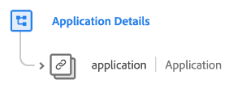

# [!UICONTROL Application Details] groupe de champs de schéma

[!UICONTROL Application Details] groupe de champs de schéma standard pour la [[!DNL XDM ExperienceEvent] classe](../../classes/experienceevent.md). Le groupe de champs fournit un seul objet `application` à un schéma, qui capture les détails liés à l’application, tels que les blocages, l’utilisation des fonctionnalités, les lancements et les mises à niveau.

| Propriété | Type de données | Description |
| --- | --- | --- |
| `application` | [[!UICONTROL Application]](../../data-types/financial-account.md) | Capture les informations sur l’application associées à un événement, y compris le nom de l’application, sa version, les installations, les lancements, les blocages et les fermetures. Il peut s’agir de l’application ciblée par l’événement (comme la destination d’une notification push envoyée) ou de l’application d’où provient l’événement (comme un clic ou une connexion). |

{style="table-layout:auto"}

Pour plus d’informations sur le groupe de champs , consultez le [référentiel XDM public](https://github.com/adobe/xdm/blob/master/docs/reference/fieldgroups/experience-event/experienceevent-application.schema.json).
