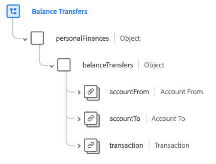

# [!UICONTROL Transferts de solde] groupe de champs de schéma

[!UICONTROL Transferts de solde] est un groupe de champs de schéma standard pour la [[!DNL XDM ExperienceEvent] classe](../../classes/experienceevent.md). Le groupe de champs fournit un seul objet `personalFinances.balanceTransfers` à un schéma, qui capture les détails d’un transfert de solde financier entre les comptes.

| Propriété | Type de données | Description |
| --- | --- | --- |
| `accountFrom` | [[!UICONTROL Compte financier]](../../data-types/financial-account.md) | Décrit le compte financier à partir duquel le solde est transféré. |
| `accountTo` | [[!UICONTROL Compte financier]](../../data-types/financial-account.md) | Décrit le compte financier vers lequel le solde est transféré. |
| `transaction` | [[!UICONTROL &#x200B; Transaction &#x200B;]](../../data-types/transaction.md) | Décrit la transaction financière associée au transfert de solde. |

{style="table-layout:auto"}

Pour plus d’informations sur le groupe de champs , consultez le [référentiel XDM public](https://github.com/adobe/xdm/blob/master/docs/reference/fieldgroups/experience-event/industry-verticals/experienceevent-balance-transfers.schema.json).
