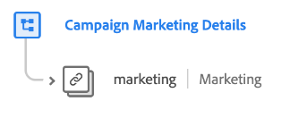

# [!UICONTROL Détails marketing de la campagne] groupe de champs de schéma

>[!NOTE]
>
>Les noms de plusieurs groupes de champs de schéma ont changé. Pour plus d’informations, consultez le document sur les [mises à jour des noms de groupes de champs](../name-updates.md).

[!UICONTROL Détails marketing de la campagne] est un groupe de champs de schéma standard pour la [[!DNL XDM ExperienceEvent] classe](../../classes/experienceevent.md), utilisé pour décrire les informations de la campagne marketing telles que le groupe de la campagne, le nom et le code de suivi.

| Propriété | Type de données | Description |
| --- | --- | --- |
| `marketing` | [Marketing ](../../data-types/marketing.md) | Objet qui décrit les informations sur la campagne marketing telles que le groupe de la campagne, le nom et le code de suivi. |

{style="table-layout:auto"}

Pour plus d’informations sur le groupe de champs , consultez le référentiel XDM public :

* [Exemple renseigné](https://github.com/adobe/xdm/blob/master/components/fieldgroups/experience-event/experienceevent-marketing.example.1.json)
* [Schéma complet](https://github.com/adobe/xdm/blob/master/components/fieldgroups/experience-event/experienceevent-marketing.schema.json)
