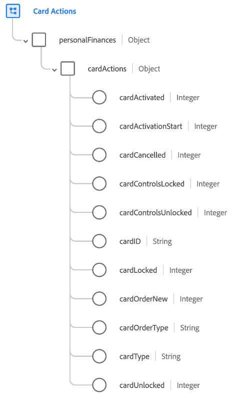

# [!UICONTROL Card Actions] groupe de champs de schéma

[!UICONTROL Card Actions] groupe de champs de schéma standard pour la [[!DNL XDM ExperienceEvent] classe](../../classes/experienceevent.md). Le groupe de champs fournit un champ de `personalFinances.cardActions` unique à un schéma, qui capture les détails d’une action de carte, tels que le type de carte, le statut d’activation et le statut de verrouillage.

| Propriété | Type de données | Description |
| --- | --- | --- |
| `cardActivated` | Entier | Indique à quel moment la carte a été activée. |
| `cardActivationStart` | Entier | Indique à quel moment le processus d’activation de la carte a commencé. |
| `cardCancelled` | Entier | Indique quand une carte a été annulée. |
| `cardControlsLocked` | Entier | Indique à quel moment les commandes d’une carte ont été verrouillées. |
| `cardControlsUnlocked` | Entier | Indique à quel moment les contrôles d’une carte ont été déverrouillés. |
| `cardID` | Chaîne | Identifiant de la carte en cours d’activation. Cette valeur peut être différente du numéro de carte. |
| `cardLocked` | Entier | Indique à quel moment une carte a été verrouillée. |
| `cardOrderNew` | Entier | Indique à quel moment une carte a été demandée. |
| `cardOrderType` | Chaîne | Type de commande de carte associé à un événement de commande de carte. |
| `cardType` | Chaîne | Type de carte. |
| `cardUnlocked` | Entier | Indique à quel moment une carte a été déverrouillée. |

{style="table-layout:auto"}

Pour plus d’informations sur le groupe de champs , consultez le [référentiel XDM public](https://github.com/adobe/xdm/blob/master/docs/reference/fieldgroups/experience-event/experienceevent-card-actions.schema.json).
