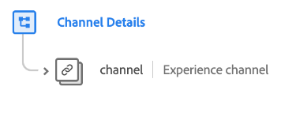

# [!UICONTROL Channel Details] groupe de champs de schéma

>[!NOTE]
>
>Les noms de plusieurs groupes de champs de schéma ont changé. Pour plus d’informations, consultez le document sur les [mises à jour des noms de groupes de champs](../name-updates.md).

[!UICONTROL Channel Details] est un groupe de champs de schéma standard pour la [[!DNL XDM ExperienceEvent] classe](../../classes/experienceevent.md) utilisé pour décrire les informations sur le canal telles que l’identifiant, le type de canal, le type de média et le type d’emplacement.

| Propriété | Type de données | Description |
| --- | --- | --- |
| `channel` | [Canal Experience](../../data-types/experience-channel.md) | Objet décrivant les retours de produits, l’enregistrement de la garantie et les processus de commande/panier. |

{style="table-layout:auto"}

Pour plus d’informations sur le groupe de champs , consultez le référentiel XDM public :

* [Exemple renseigné](https://github.com/adobe/xdm/blob/master/components/fieldgroups/experience-event/experienceevent-channel.example.1.json)
* [Schéma complet](https://github.com/adobe/xdm/blob/master/components/fieldgroups/experience-event/experienceevent-channel.schema.json)
