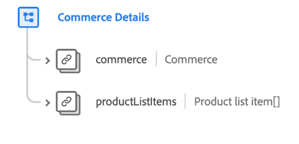

# [!UICONTROL Détails Commerce &#x200B;] groupe de champs de schéma

>[!NOTE]
>
>Les noms de plusieurs groupes de champs de schéma ont changé. Pour plus d’informations, consultez le document sur les [mises à jour des noms de groupes de champs](../name-updates.md).

[!UICONTROL Détails &#x200B;] est un groupe de champs de schéma standard pour la [[!DNL XDM ExperienceEvent] classe](../../classes/experienceevent.md), utilisé pour décrire des données commerciales telles que des informations sur le produit (SKU, nom, quantité) et des opérations de panier standard (commande, passage en caisse, abandon).

| Propriété | Type de données | Description |
| --- | --- | --- |
| `commerce` | [&#128279;](../../data-types/commerce.md) | Objet décrivant les retours de produits, l’enregistrement de la garantie et les processus de commande/panier. |
| `productListItems` | Tableau d’[éléments de la liste de produits](../../data-types/product-list-item.md) | Liste d’éléments représentant le ou les produits sélectionnés par un client, avec des options et des prix spécifiques à un moment donné (qui peut différer de l’enregistrement du produit). |

{style="table-layout:auto"}

Pour plus d’informations sur le groupe de champs , consultez le référentiel XDM public :

* [Exemple renseigné](https://github.com/adobe/xdm/blob/master/components/fieldgroups/experience-event/experienceevent-commerce.example.1.json)
* [Schéma complet](https://github.com/adobe/xdm/blob/master/components/fieldgroups/experience-event/experienceevent-commerce.schema.json)
