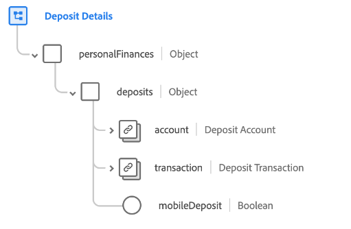

# [!UICONTROL Détails du dépôt] groupe de champs de schéma

[!UICONTROL Détails du dépôt] est un groupe de champs de schéma standard pour la variable [[!DNL XDM ExperienceEvent] class](../../classes/experienceevent.md). Le groupe de champs fournit une `personalFinances.deposits` à un schéma, qui capture les détails d’un dépôt financier.

| Propriété | Type de données | Description |
| --- | --- | --- |
| `account` | [[!UICONTROL Compte financier]](../../data-types/financial-account.md) | Décrit le compte financier associé au dépôt. |
| `transaction` | [[!UICONTROL Transaction]](../../data-types/transaction.md) | Décrit la transaction financière associée au dépôt. |
| `mobileDeposit` | [!UICONTROL Booléen] | Indique si le dépôt a été effectué via une plateforme mobile. |

{style="table-layout:auto"}

Pour plus d’informations sur le groupe de champs, reportez-vous à la section [référentiel XDM public](https://github.com/adobe/xdm/blob/master/docs/reference/fieldgroups/experience-event/industry-verticals/experienceevent-deposit-details.schema.json).
